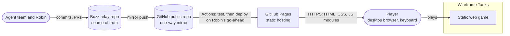
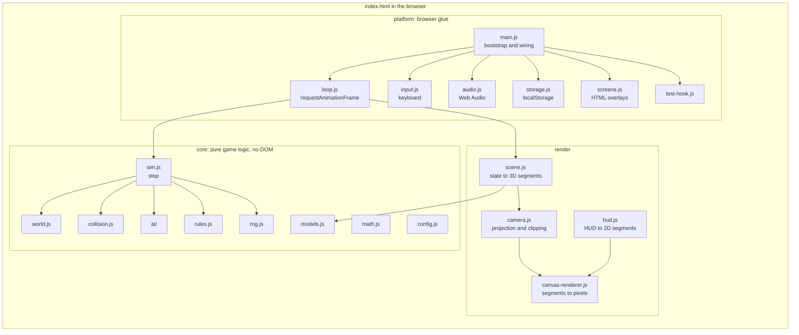
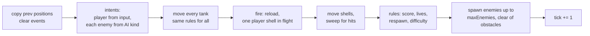
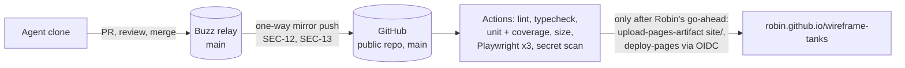

# Wireframe Tanks — architecture

**Author:** Architect. **Date:** 2026-10-01. **Stage:** Requirements and Design (merged). **Inputs:** `docs/IDEA_BRIEF.md`, `docs/RESEARCH_BRIEF.md`, `docs/PRODUCT_BRIEF.md` (at `260b20a`), `docs/TEST_STRATEGY.md`, `docs/THREAT_MODEL.md`, decisions D-24, D-37, D-41.

This is a small static game, and the design is sized for that. There is no server, no database and no build step. The work in this document goes into three things: a clean line between game logic and the browser, a simulation that runs the same at any refresh rate, and a release artifact that contains only our own code.

`REQUIREMENTS.md` and `UX_SPEC.md` are being written in parallel. Until they land, I reference the product brief IDs (M1–M12, S1–S5, C1–C4), the Tester's testability needs (T1–T6) and the security requirements (SEC-1 to SEC-23). Exact numbers (lives, points, speeds, grace period, difficulty steps) belong to the Analyst; this design only says where they live (`config.js`).

The significant choices are recorded as ADRs in [`docs/adr/`](adr/):

| ADR | Decision |
|---|---|
| [0001](adr/0001-canvas-2d-renderer.md) | Canvas 2D with our own projection, behind a line-segment interface. No runtime dependencies. |
| [0002](adr/0002-plain-javascript-no-build.md) | Plain JavaScript ES modules with no build step. Type-checked from JSDoc. Five dev dependencies. |
| [0003](adr/0003-fixed-timestep-deterministic-simulation.md) | Fixed 60 Hz simulation step, pure and deterministic, with an injected clock and a seeded random generator. |
| [0004](adr/0004-entity-collection-and-controllers.md) | Tanks in a collection; one controller per tank; enemy kinds in a registry. |
| [0005](adr/0005-html-screens-canvas-play.md) | Start, pause and game-over screens in HTML over the canvas; play and HUD on the canvas. Designer agreed (UX-D1). |
| [0006](adr/0006-hand-written-web-audio.md) | Sound effects synthesised with hand-written Web Audio code. No ZzFX. |
| [0007](adr/0007-github-pages-from-site-folder.md) | Publish only the `site/` folder to GitHub Pages with GitHub's own Actions flow, from the public mirror. |
| [0008](adr/0008-test-hook-without-url.md) | The test hook is switched on by a global set before load, not by the URL. |

## 1. Context



The player's browser is the whole runtime. Once the page has loaded, nothing leaves it (M12): no API, no analytics, no fonts or scripts from anywhere else (SEC-1). The only thing stored is an optional best score in `localStorage` (C1).

## 2. Containers

There is one deployable: a folder of static files. Inside the page, the code splits into three layers, and the arrows only point downward to `core`.



| Layer | May use | Must not use | Runs in Node |
|---|---|---|---|
| `core/` | Plain JavaScript, `Math` | `window`, `document`, canvas, audio, storage, `Date`, `performance`, `Math.random` | Yes. All unit tests. |
| `render/scene.js`, `render/camera.js`, `render/hud.js` | `core/`, plain JavaScript | DOM, canvas | Yes. Tests check *what* is drawn (T4). |
| `render/canvas-renderer.js` | Canvas 2D context | Game state (it only sees segments) | No |
| `platform/`, `main.js` | Everything | Game rules (no scoring, movement or AI logic here) | No. Covered by Playwright. |

The rule for `core/` is enforced, not just written down: an ESLint override on `site/src/core/**` bans the browser globals with `no-restricted-globals` and `Math.random` with `no-restricted-properties`. That is what makes T1 and T3 hold as the code grows.

## 3. Repository layout

```text
site/                      <- the only folder that is published (ADR 0007)
  index.html               CSP meta tag, no inline script or style (SEC-17, SEC-18)
  styles.css
  src/
    main.js
    core/      config.js math.js rng.js models.js world.js collision.js rules.js sim.js
               ai/registry.js ai/hunter.js
               game.js           screen state machine: start, playing, paused, game over
               best-score.js     parse and validate a stored value (SEC-22)
    render/    camera.js scene.js hud.js palette.js canvas-renderer.js
    platform/  loop.js input.js audio.js storage.js screens.js test-hook.js
test/
  unit/        *.test.js         node:test, mirrors site/src/core and site/src/render
  e2e/         *.spec.js         Playwright (Tester owns)
scripts/
  serve.js     tiny static server on node:http, used by Playwright and for local play
  check-size.js  fails if site/ is over 500 KB
docs/          stage artifacts, ADRs in docs/adr/
package.json   "private": true, "type": "module", devDependencies only
package-lock.json
eslint.config.js
jsconfig.json  checkJs, strict, noEmit
.npmrc         ignore-scripts=true (SEC-4)
.github/workflows/  Engineer owns
```

`main.js` is the only file that knows every layer. Everything else gets what it needs passed in.

## 4. Components

### 4.1 Core (pure)

| Module | Responsibility | Main interface |
|---|---|---|
| `config.js` | Every tunable number in one frozen object: step rate, speeds, turn rates, shell speed and range, hit radii, arena size, lives, points, grace period, difficulty table, maximum enemies (1 in the MVP). | `CONFIG` |
| `math.js` | 2D and 3D vector helpers, angle wrapping, linear interpolation. | plain functions |
| `rng.js` | Seeded generator (mulberry32 or similar). The state is a 32-bit integer stored in the game state, so a saved state replays exactly. | `nextFloat(state) → number` (advances `state.rng`) |
| `models.js` | Our own wireframe models as vertex and edge lists: player tank silhouette (for hit feedback), enemy tank, obstacle shapes, horizon. Drawn from the Designer's line art in `UX_SPEC.md` (M11, P4). | `MODELS.enemyTank = { vertices, edges }` |
| `world.js` | Builds a new game state: arena, obstacles (fixed layout from config, or seeded placement), player tank. | `createWorld(seed, config) → GameState` |
| `collision.js` | All collision on the ground plane. Tanks are circles. Obstacles are circles or rotated rectangles. Shells are swept as a segment from last position to this one, so a fast shell cannot tunnel through a thin obstacle. | `resolveTankMove`, `sweepShell`, `isClear(pos, radius)` |
| `ai/registry.js` | Maps an enemy `kind` to its controller. The MVP has one kind, `hunter`. | `AI[kind].think(memory, tank, view, rng) → Intent` |
| `ai/hunter.js` | The state machine from research §7: spawn, approach, aim, evade, with seek and obstacle-avoidance steering. Its tuning (turn rate, aim tolerance, reload) comes from the current difficulty level (S3). | see above |
| `rules.js` | Scoring, lives, respawn, spawning enemies clear of obstacles, difficulty level from score, game over. | `applyHit`, `spawnEnemies`, `difficultyFor(score)` |
| `sim.js` | One fixed step of the whole game. | `step(state, input) → void`, mutates `state`, appends to `state.events` |
| `game.js` | The screen state machine (start, playing, paused, game over) and restart. | `handleCommand(state, command)` |
| `best-score.js` | Parses a stored string into a safe integer, or rejects it (SEC-22). | `parseBestScore(raw) → number \| null` |

### 4.2 Game state

One plain, serialisable object. No classes, no closures, no references to the DOM. That is what lets a test build a state by hand, step it, and compare it.

```js
/** @typedef {{ x: number, z: number }} Vec2 */
/** @typedef {{
 *   id: number, side: 'player' | 'enemy', kind: string,
 *   pos: Vec2, prevPos: Vec2, heading: number, prevHeading: number,
 *   alive: boolean, reload: number, graceTicks: number,
 *   control: { type: 'player' } | { type: 'ai', memory: object }
 * }} Tank */
/** @typedef {{ id: number, ownerId: number, pos: Vec2, prevPos: Vec2, vel: Vec2, ticksLeft: number }} Shell */
/** @typedef {{
 *   screen: 'start' | 'playing' | 'paused' | 'gameover',
 *   tick: number, rng: number, nextId: number,
 *   tanks: Tank[], shells: Shell[], obstacles: Obstacle[],
 *   playerId: number, score: number, lives: number, level: number,
 *   events: GameEvent[]
 * }} GameState */
```

- **Ground plane:** X and Z, with Y up. Heading 0 faces +Z; a positive turn is clockwise seen from above, towards +X.
- **Tanks are a collection.** The player is the tank whose `id` is `playerId`. There is no `state.enemy` field anywhere. This is Product's Phase 2 constraint, and ADR 0004.
- **`prevPos` and `prevHeading`** are copied at the start of each step, so the renderer can interpolate between steps (section 5.2).
- **`events`** is cleared at the start of each step and filled during it: `shot` (either side; carries `tankId`), `shell-blocked`, `tank-hit`, `player-hit`, `enemy-spawned`, `enemy-aiming`, `level-up`, `game-over`. Audio, hit feedback and the test hook read them. The simulation never calls out to anything.
- **`enemy-aiming`** is emitted by `sim.js`, not by the AI: after each enemy's `think`, the step compares the AI's state before and after, and emits the event once when it changes into `aim`. That drives the UX warning sound ("at most once per aim", `UX_SPEC.md` §12). The locator's warning ring needs no event: `hud.js` reads the enemy's current AI state from the game state every frame. Any future AI kind gets the warning for free as long as it names its aiming state `aim`.
- **Each event carries `tick`**, so its simulation time is `tick / 60` s. The history of events since load is kept by the test hook, not by the simulation (section 4.5, ADR 0008).

### 4.3 One simulation step



Player and enemy tanks go through the same movement, firing and collision code. Only the source of the *intent* differs: `{ throttle: -1..1, turn: -1..1, fire: boolean }` from the keyboard, or from the AI. So the enemy cannot cheat by accident, and a second enemy kind is a new `think` function, not new physics.

### 4.4 Render

| Module | Responsibility | Interface |
|---|---|---|
| `camera.js` | Camera at the player's eye height, looking along the heading (yaw only). Transforms world points to camera space, clips each segment against the near plane, and projects to screen pixels. Points behind the camera are clipped, never mirrored. | `projectSegments(segments3d, camera, viewport, out2d) → count` |
| `scene.js` | Turns the game state into a flat list of 3D line segments: obstacles, live tanks, shells, horizon. Interpolates positions with `alpha` (section 5.2). Culls objects beyond the far distance or wholly behind the camera before projection. | `buildScene(state, alpha, out3d) → count` |
| `hud.js` | Turns the state into 2D segments and text items for the HUD: crosshair, enemy locator (M8), score, lives, hit feedback (S5). Layout and form come from `UX_SPEC.md`. | `buildHud(state, viewport, out) → { segments, texts }` |
| `canvas-renderer.js` | Clears the canvas and strokes each palette key's segments as a single path with that key's colour, width and dash. Draws HUD text with `fillText`. Knows nothing about tanks. | `draw(ctx, buckets, hud, palette)` |
| `palette.js` | The palette keys, line widths, dash patterns and the CSS token each colour comes from (`UX_SPEC.md` §8.2). | `PALETTE_SPEC` |

**Palette and stroke styles.** Every segment carries a palette key. `scene.js` and `hud.js` write segments into one buffer per key, and `canvas-renderer.js` draws each key as one path with its own colour, line width and dash pattern. That keeps the "one stroke per style" rule from section 6.1. The keys, widths and dashes come from `UX_SPEC.md` §8.2 and live in `render/palette.js`:

| Key | Colour token | Line width (CSS px) | Dash |
|---|---|---|---|
| `background` | `--wt-color-bg` | — | — |
| `horizon` | `--wt-color-horizon` | 1.5 | solid |
| `world` | `--wt-color-world` | 1.5 | solid |
| `playerShell` | `--wt-color-world` | 1.5 | solid |
| `enemy` | `--wt-color-enemy` | 2 | solid |
| `enemyShell` | `--wt-color-enemy` | 2 | solid |
| `enemyGrace` | `--wt-color-enemy` | 2 | `[6, 4]` |
| `hud` | `--wt-color-text` | 2 | solid |
| `hudDim` | `--wt-color-text-dim` | 2 | solid; the "cannot fire" crosshair uses `[3, 5]` |
| `alert` | `--wt-color-alert` | 10 (hit frame) | solid |

- **One source of truth for colour:** `main.js` reads the colour tokens once at start-up with `getComputedStyle(document.documentElement)` and passes the resolved palette to the renderer (`UX_SPEC.md` §8). `palette.js` holds only keys, widths, dashes and token names, so it stays pure and testable.
- **Widths are CSS pixels.** The renderer multiplies line widths and dash lengths by the same `devicePixelRatio` scale it applies to the canvas, so lines keep their designed weight on high-density screens.
- **The grace state is a scene decision:** `scene.js` puts an enemy with `graceTicks > 0` under `enemyGrace` and switches it to `enemy` when the grace period ends. A unit test can check that without a canvas.
- **Bucket sizes:** each key's buffer is preallocated. The total across all keys stays inside the 1,500-segment budget.

**This is the renderer seam the research brief and Product asked for (T4).** Everything left of `canvas-renderer.js` produces numbers. A test can assert "the enemy is in front, so its segments are inside the viewport" or "the locator points left" without a canvas. A later move to WebGL replaces only `canvas-renderer.js` (ADR 0001).

Segments are written into preallocated `Float32Array` buffers that are reused every frame, so drawing allocates no garbage and causes no GC pauses.

### 4.5 Platform

| Module | Responsibility |
|---|---|
| `loop.js` | Drives the game from `requestAnimationFrame`. Takes `now`, `requestFrame`, `step` and `render` as parameters (T2). The accumulator maths is a pure exported function, `advance(acc, elapsedMs) → { steps, acc, alpha }`, unit-tested on its own (section 5.2). |
| `input.js` | Listens to `keydown` and `keyup`, keyed by `KeyboardEvent.code` (M3). Keeps a set of held keys and a queue of presses since the last step (fire, pause, mute, start, restart). Calls `preventDefault` for Space and the arrow keys so the page does not scroll. Clears held keys on `blur`. Produces one input snapshot per step. Key bindings live in one table. |
| `audio.js` | Creates the `AudioContext` on the first key press (the browser's autoplay rule, research §6). Plays sounds for simulation events. Mute toggles a master gain (S2). ADR 0006. |
| `storage.js` | Reads and writes the best score under `wireframe-tanks:best-score` (SEC-21), inside `try`/`catch`, and validates with `core/best-score.js` (SEC-22). If storage fails the game still runs. Only built if C1 is. |
| `screens.js` | Shows and hides the HTML overlays for the start, pause and game-over screens, and writes their text with `textContent` only (SEC-19). ADR 0005. |
| `test-hook.js` | Exposes a read-only snapshot of the state for end-to-end tests, only when the test runner has asked for it (T5). After every step it copies that step's events into its own ring buffer of the last 1,000 events since load, so a test that polls between frames misses nothing. The snapshot also carries a `view` record with the camera shake offset and hit-flash state actually used in the last frame, so a reduced-motion test can see the shake is zero. ADR 0008. |
| `main.js` | Creates the state, wires input, loop, renderer, audio, screens, storage and the test hook. Installs the error handler (section 6.5). Pauses on `visibilitychange` (hidden) and window `blur` (S4). |

## 5. Key mechanisms

### 5.1 Projection

Camera space has x to the right, y up and z forward. With a vertical field of view `fov` and a viewport `w × h`:

```text
f  = (h / 2) / tan(fov / 2)
sx = w / 2 + f * x / z
sy = h / 2 - f * y / z
```

`fov` is **40° vertical** (`CONFIG.fovVerticalDeg = 40`, `UX_SPEC.md` UX-D6). The horizontal field of view follows from the aspect ratio, `2 · atan(tan(fov / 2) · w / h)`, which is about 66° at 16:9. `camera.js` exports it, because the HUD's bearing-tape bracket and the "enemy out of view" test for the edge chevron both depend on it, and the projection and the HUD must agree on what "in view" means.

Each segment is clipped to `z ≥ near` (for example 0.1) before the divide. The canvas itself clips anything that projects off-screen, so no other clipping is needed. All of this is plain arithmetic in `camera.js` and is the first thing to unit test (test strategy §3.1).

### 5.2 Loop and timing (M10)

```text
on each animation frame(now):
  elapsed = min(now - last, 250 ms)          // a background tab cannot cause a jump
  acc += elapsed
  steps = 0
  while acc >= STEP and steps < 5:           // STEP = 1000 / 60 ms
    if state.screen == 'playing': step(state, input.snapshot())
    acc -= STEP; steps += 1
  if steps == 5: acc = 0                      // a slow machine slows down, it does not spiral
  render(state, alpha = acc / STEP)
```

- The simulation only ever advances in whole 1/60 s steps, so the game runs at the same speed at 60, 120 or 144 Hz.
- The renderer interpolates tank and shell positions between `prev*` and the current values by `alpha`. On a 144 Hz monitor motion stays smooth even though the simulation runs at 60 Hz. Interpolation is in the renderer only; it never feeds back into the state.
- **Test for M10:** feed `advance` and `step` the same inputs with frame intervals of 16.67 ms and of 6.94 ms for ten simulated seconds, and assert the final states are equal. That is a pure Node test (T2).
- Pause stops stepping but keeps rendering, so the pause screen sits over a frozen frame.

### 5.3 Randomness and determinism (T3)

Every random choice (enemy spawn position, AI wander, any seeded obstacle placement) goes through `rng.js`, whose state lives in `GameState.rng`. The seed comes from `crypto.getRandomValues` in normal play, or from the test runner (ADR 0008). Same seed plus same inputs gives the same game, which makes defects replayable.

### 5.4 Enemies and AI (M6, S3, Phase 2 constraint)

- `rules.spawnEnemies` keeps the number of live enemies at `CONFIG.maxEnemies`, which is **1** in the MVP. Spawn points are picked with the seeded generator at a set distance from the player and checked with `collision.isClear`. A new enemy gets `graceTicks` and cannot fire until they run out (research §7).
- Each enemy tank carries its own AI memory in `control.memory`. There is one AI *instance* per tank, so two enemies never share state.
- `ai/registry.js` maps `kind` to a `think` function. The MVP registers `hunter` only.
- **What Phase 2 changes:** raising `maxEnemies`, and adding a kind to the registry with its model and tuning. Neither needs a change to `sim.js`, the renderer or the HUD's data flow. The locator would then show more than one enemy, which is a Designer question for that phase. Per Product, none of this is built now.

### 5.5 Collision (M5, M7)

- Everything collides on the ground plane. Obstacles are infinitely tall for collision purposes, and shells fly at a fixed height, so 2D tests are enough.
- A tank that would overlap an obstacle, the arena edge or another tank is pushed back out along the contact normal. It slides along walls instead of sticking.
- Shells are swept from `prevPos` to `pos` each step against obstacles and tanks. The nearest hit along the sweep wins. A shell cannot hit the tank that fired it.
- **Arena edge:** the product brief leaves "bounded or wrap" to the Analyst and Designer (product brief §12, question 5). I recommend **bounded**. Wrapping on a first-person view means drawing objects twice across the seam and measuring distances on a torus, in the AI, the locator and collision. Bounded is a clamp. If they choose wrap, it is contained in `collision.js`, `scene.js` and a distance helper, but it costs more test cases.

### 5.6 Text and lettering (M11)

No web fonts are loaded (SEC-1, and the CSP's `font-src 'self'` would allow only our own). HUD text is either drawn with `fillText` in a generic system font, or as our own vector lettering made of segments. That is the Designer's call in `UX_SPEC.md`. Both fit the segment budget in section 6.1.

## 6. Non-functional requirements

### 6.1 Performance: 60 fps (product brief metric 3)

| Budget | Target per frame | Basis |
|---|---|---|
| Simulation | Under 1 ms for the steps in one frame | One player, one enemy, a few shells and about 20 obstacles. Trivial arithmetic. |
| Scene and projection | Under 1 ms | Linear in segments. |
| Drawing | Under 5 ms at p95 | Spike: about 1,000 segments in 2.3 ms mean, 2.8 ms p95 (research §5.2). |
| **Segment budget** | **At most 1,500 drawn segments**, including the HUD | Expected scene: about 600 (obstacles, one tank, horizon, HUD). |

How the design keeps it there:

- No `shadowBlur` and no glow (P2). Plain `stroke()`.
- One `beginPath` and one `stroke` per colour, not per segment.
- No allocation per frame: preallocated typed arrays for segments.
- Objects beyond the far distance, or wholly behind the camera, are culled before projection.
- Canvas backing size is the CSS size times `devicePixelRatio`, capped at 2, so a 4K display does not quadruple the fill cost.
- A debug overlay (frame time, simulation time, segment count) toggles on a key, for the Developer and for the Tester's manual run. It reads nothing from the URL (SEC-20).

The real 60 fps verdict is the Tester's manual run on the reference laptop (test strategy §3.3).

### 6.2 Same speed at any refresh rate (M10)

Fixed timestep with accumulator and frame clamp (section 5.2, ADR 0003). Unit-tested at 60 Hz and 144 Hz frame intervals, and checked by hand on a high-refresh monitor if one is available.

### 6.3 Page weight under 500 KB, and no network calls after load (M12)

- **No runtime dependencies (SEC-1).** The published folder holds `index.html`, `styles.css` and our own JavaScript modules. No images, no fonts, no audio files.
- **Expected size:** under 150 KB unminified, before GitHub Pages' gzip. `scripts/check-size.js` fails CI over 500 KB.
- **Only static `import` statements.** No `import()`, no `fetch`, no `XMLHttpRequest`, no `WebSocket`. Module scripts are deferred, so the whole module graph is fetched before the `load` event.
- **The favicon.** Browsers ask for `/favicon.ico` on their own, possibly after `load`, which would fail the Tester's zero-requests check and log a 404. `index.html` declares `<link rel="icon" href="data:,">` to stop that request. The CSP allows `img-src data:`.
- **The CSP enforces it:** `connect-src 'none'` blocks any network call from script (SEC-17). The Tester's network recorder checks it independently (test strategy scenario 9).

### 6.4 Security (threat model §4)

| Requirement | How the design meets it |
|---|---|
| SEC-1 zero runtime dependencies | Nothing third-party in `site/`. ADR 0002 has no bundler and ADR 0006 does not vendor ZzFX, so there is no route for third-party code into the artifact. |
| SEC-2 dev dependencies listed | Section 8. |
| SEC-17 CSP | `<meta http-equiv="Content-Security-Policy">` as the first child of `<head>`, before any script, with Security's starting policy unchanged: `default-src 'self'; script-src 'self'; style-src 'self'; img-src 'self' data:; font-src 'self'; connect-src 'none'; object-src 'none'; base-uri 'none'; form-action 'none'`. ES module imports from our own origin are allowed by `script-src 'self'`. |
| SEC-18 no inline script or style | One `<script type="module" src="src/main.js">`. All CSS in `styles.css`. No `style=` or `on*=` attributes. JavaScript may set `element.style` and `hidden`. |
| SEC-19 no HTML sinks | Screens use `textContent` only. ESLint rules ban `eval`, `new Function`, string timers and `innerHTML`, `outerHTML`, `insertAdjacentHTML` and `document.write`. |
| SEC-20 referrer, no URL input | `<meta name="referrer" content="no-referrer">`. The game reads nothing from the URL. The test hook does not use the URL either (ADR 0008). |
| SEC-21, SEC-22 best score | Namespaced key, validated on read, storage errors caught (section 4.5). |
| SEC-3 to SEC-15, SEC-23 | Engineer's CI and repository settings. The design adds nothing that conflicts with them. |

### 6.5 Availability and resilience

- GitHub Pages serves static files over HTTPS. There is nothing of ours to keep running.
- Relative URLs throughout, because a project site lives under `/wireframe-tanks/`, not at the domain root.
- **Errors:** `main.js` handles `error` and `unhandledrejection` on `window`. It stops the loop and shows an error overlay with a short message written by `textContent`. The wording is the Designer's. Nothing is reported anywhere, because there is nowhere to send it (M12).
- **Unsupported browsers:** the target is the current and previous versions of Chrome, Edge, Firefox and Safari, with ES2022 modules. A browser without canvas or modules gets a short `<noscript>`-style message in the HTML instead of a blank page.
- **Mixed versions during a deploy:** GitHub Pages caches files for about ten minutes, so for a short while after a deploy a player could get a new `main.js` with an older module. The risk is low for a hobby game and is accepted. If it bites, the fix is a version query on the imports, generated at deploy.

### 6.6 Observability

There is no telemetry in the MVP (M12, product brief Won't list). What exists instead:

- The debug overlay (section 6.1) for frame and simulation timing.
- No console output in normal play, so any console error is a real defect (test strategy scenario 11).
- The test hook's snapshot and the event list, which make an end-to-end failure explainable without screenshots.
- CI artifacts on failure: Playwright traces, screenshots and console logs (test strategy §5).

### 6.7 Accessibility

The Designer sets the requirements in `UX_SPEC.md`. The design supports them by keeping the screens in HTML (ADR 0005), so they get real text, focus order and axe checks; by keyboard-only control throughout; by keeping colours in one palette object fed from the Designer's tokens, so contrast is fixed in one place; and by giving the canvas `role="img"` and an `aria-label`.

## 7. Testability (test strategy §2)

| Need | Met by |
|---|---|
| T1 game logic separate from drawing, audio and input | `core/` is pure and runs in Node. The ESLint override bans browser globals in it (section 2). |
| T2 injectable clock | The simulation has no clock: it advances one fixed step per call. `loop.js` takes `now` and `requestFrame` as parameters, and its accumulator maths is the pure function `advance`. |
| T3 seedable randomness | `rng.js`, with its state inside `GameState`. `Math.random` is banned in `core/` by lint. |
| T4 renderer takes line segments | `scene.js` and `hud.js` output segment buffers. `canvas-renderer.js` only draws them. |
| T5 read-only test hook | ADR 0008: a frozen copy of the state, switched on by a global set before load. |
| T6 screens in HTML | ADR 0005. The Designer agreed in `UX_SPEC.md` (UX-D1). |

Unit tests use Node's built-in `node:test` runner and its built-in coverage, with a line-coverage gate of 90% on `core/` (test strategy §3.1). End-to-end tests use Playwright against `scripts/serve.js`, which serves `site/` the same way Pages does. For time-dependent end-to-end checks, Playwright's `page.clock` can control the page's timers; the Tester should confirm it drives `requestAnimationFrame` in all three engines before relying on it.

## 8. Technology stack

| Concern | Choice | Why |
|---|---|---|
| Language | JavaScript (ES2022 modules) with JSDoc types | Runs in the browser as written; no build step (ADR 0002). |
| Type checking | `tsc --noEmit` with `checkJs` over the JSDoc | Catches unit and shape mistakes in the maths without compiling anything we ship. |
| Rendering | Canvas 2D, own projection | ADR 0001. |
| Audio | Web Audio API, hand-written | ADR 0006. |
| Unit tests and coverage | `node:test`, `node --test --experimental-test-coverage` | Built into Node, so no test dependency. |
| End-to-end and accessibility tests | Playwright with `@axe-core/playwright` | Tester's choice (test strategy §3.2, D-50). |
| Lint | ESLint flat config with `@eslint/js` | Enforces SEC-19 and the `core/` purity rule. |
| Local server | `scripts/serve.js` on `node:http` | Twenty lines; no `http-server` dependency. |
| Runtime for tools | Node.js current LTS (24) in CI; `engines` set to `>=22` | `node:test` coverage thresholds need a recent Node. |
| Hosting | GitHub Pages through GitHub Actions | D-41, ADR 0007. |

### Dev dependencies (SEC-2)

The complete list. Nothing here ships to players.

| Package | Purpose | Owner |
|---|---|---|
| `typescript` | Type-check the JSDoc (`tsc --noEmit`) | Developer |
| `eslint` | Lint, including the SEC-19 and `core/` purity rules | Developer, Security |
| `@eslint/js` | ESLint's recommended rule set | Developer |
| `@playwright/test` | End-to-end tests in Chromium, Firefox and WebKit | Tester |
| `@axe-core/playwright` | Automated accessibility checks | Tester |

The secret scanner (SEC-14, SEC-15) is a CI tool chosen by the Engineer, not an npm package. Any further dev dependency needs a reason in the PR that adds it (SEC-2) and my review.

## 9. Interfaces

There is no network API, so there is no OpenAPI document. The interfaces that matter are internal, and these are the ones other lanes depend on:

| Interface | Shape | Used by |
|---|---|---|
| Simulation | `step(state: GameState, input: InputSnapshot): void` | `loop.js`, unit tests |
| Input snapshot | `{ throttle: -1\|0\|1, turn: -1\|0\|1, firePressed: boolean, commands: Command[] }` with commands `start`, `pause`, `resume`, `mute`, `restart`, `quit-to-title`, `debug`. `firePressed` is set by a key-down that is not an auto-repeat (BR-01). Commands come from keys during play and from the HTML screens' buttons and Enter/Esc handling (BR-18, BR-20 as amended for X1, X2). | `input.js` and `screens.js` produce, `sim.js` and `game.js` consume |
| AI kind | `think(memory, tank, view, rng) → { throttle, turn, fire }`, where `view` is a read-only summary of the player, obstacles and difficulty | `sim.js`, Phase 2 kinds |
| Scene | `buildScene(state, alpha, out: Float32Array) → segmentCount` (6 floats per 3D segment) | renderer, unit tests |
| Renderer | `draw(ctx, buckets, hud, palette)`, where `buckets` maps each palette key to a 2D segment buffer and count, and `palette` is the resolved colour, width and dash per key | `main.js` |
| Events | `{ type: 'shot' \| 'shell-blocked' \| 'tank-hit' \| 'player-hit' \| 'enemy-spawned' \| 'enemy-aiming' \| 'level-up' \| 'game-over', tick, ...details }` | audio, hit feedback, test hook |
| Test hook | `window.__WT_TEST__ = { seed }` set before load; the page adds `snapshot(): FrozenGameState & { view }` and `events(): GameEvent[]`, the last 1,000 events since load in order | Playwright only |
| Storage | key `wireframe-tanks:best-score`, value a decimal integer string | `storage.js` |

Fire acts once per key press, with auto-repeat ignored (BR-01, BR-08, confirmed by Product). The extra screens in `UX_SPEC.md` (Loading, Keyboard needed, Error, Quit to title, auto-pause when the window is too small) are page-level states in `screens.js` and `main.js`. They map onto the four game screens without adding new ones: Quit to title is the `start` screen, and the small-window auto-pause is the `paused` screen.

## 10. Deployment



- **Artifact:** the `site/` folder exactly as committed. No build. What was tested is byte-for-byte what is served.
- **Only `site/` is published.** `docs/`, tests and scripts stay in the repository and are never served.
- **Source of truth:** the Buzz relay repo. GitHub receives one-way mirror pushes (SEC-12).
- **CI before merge:** PRs are reviewed on the relay, but GitHub Actions runs on the mirror. So until the mirror exists, the Developer attaches local evidence (`npm test`, lint, typecheck, size) to each PR. How PR branches reach CI before merge is the Engineer's design in the CI issue.
- **Deploy:** GitHub's `upload-pages-artifact` and `deploy-pages` flow with OIDC, no stored secret, through the `github-pages` environment restricted to `main` (SEC-8, SEC-9). The first deploy, and creating the public repo at all, waits for Robin's go-ahead (playbook rule 6).
- **Environments:** local (`node scripts/serve.js`), CI (the same server), and production on Pages. No staging: the CI run against the exact artifact is the staging check, which is proportionate for a static game.
- **Rollback:** revert the commit on the relay, mirror, and redeploy. The previous artifact is also re-deployable from its Actions run.

The Engineer owns the workflows, mirror and runbook (`DEPLOY_RUNBOOK.md`). This section only fixes the shape.

## 11. Coordination with other lanes

| Lane | What this design needs or gives |
|---|---|
| Analyst | All numbers go into `config.js`: lives, points per kill, speeds, turn rates, shell speed, range and reload, hit radii, arena size, spawn distance, grace period, difficulty table, `maxEnemies = 1`. Also: fire on press or repeat while held; bounded or wrapped arena (I recommend bounded, section 5.5). |
| Designer | Line art for the tanks, obstacles and horizon as vertex and edge lists for `models.js`; HUD layout and locator form for `hud.js`; colour tokens for the palette object; HUD lettering (system font or our own vector letters); whether the screens are HTML (ADR 0005); the error message wording. |
| Security | The CSP is adopted unchanged. SEC-20 holds because the test hook does not read the URL (ADR 0008). |
| Tester | T1–T5 are met as described in section 7. T6 follows the Designer. |
| Engineer | Repository layout (section 3), dev dependency list (section 8), publish `site/` only (ADR 0007), Node LTS 24 in CI, `.npmrc` with `ignore-scripts=true`. |
| DBA | No database and no data model. The only stored item is one validated integer in `localStorage`. No work for this phase. |

## 12. Risks

| # | Risk | Likelihood | Impact | Response |
|---|---|---|---|---|
| 1 | Canvas 2D is slower in Firefox or Safari than in the Chrome spike | Low | Medium | Segment budget with a 3× margin. Re-run the spike in each browser early in Build (research risk 4). |
| 2 | Game logic leaks into `platform/` and becomes untestable | Medium | Medium | The layer rules in section 2, the lint override, and my review of every PR. |
| 3 | A later wish for solid tanks or glow | Low | Medium | Only `canvas-renderer.js` changes (ADR 0001). |
| 4 | Phase 2 enemies need rework | Low | Medium | Tank collection, per-tank controllers and the AI registry (ADR 0004). |
| 5 | Mixed module versions for a few minutes after a deploy | Low | Low | Accepted (section 6.5). |
| 6 | No CI on PRs until the mirror exists | Medium | Medium | Local evidence on each PR until the Engineer's pipeline runs. |

## 13. Phase 2 notes (not in scope)

- **More enemies and kinds:** section 5.4.
- **Multiplayer:** needs a server, which GitHub Pages cannot host (research §8), and a new threat model (threat model §7). `core/` already runs in Node with no DOM and is deterministic, so a server could run the same simulation as the authority. That is an option to evaluate then, not a commitment now.
