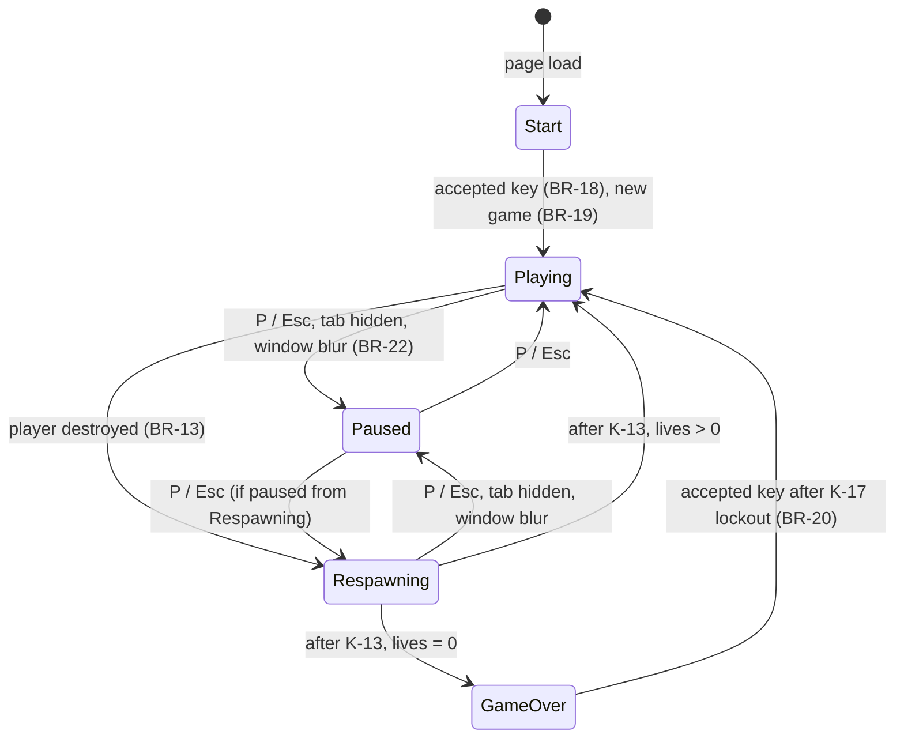
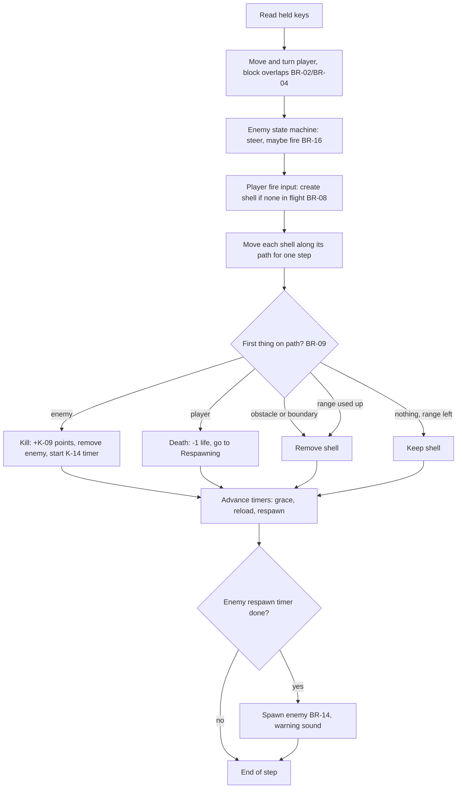
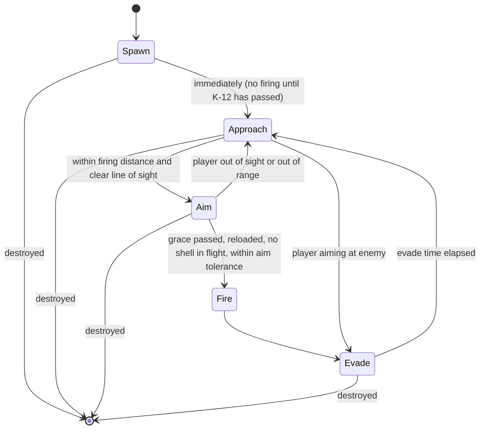

# Wireframe Tanks — requirements

**Author:** Analyst. **Date:** 2026-10-01. **Stage:** Requirements and Design (merged).
**Inputs:** `docs/IDEA_BRIEF.md`, `docs/RESEARCH_BRIEF.md`, `docs/PRODUCT_BRIEF.md`, `docs/THREAT_MODEL.md`, `docs/TEST_STRATEGY.md`, `docs/ARCHITECTURE.md` and ADRs 0001–0008, scope decision D-41.

This document turns the product brief into numbered, testable requirements. Every other artifact refers to these numbers. Product-brief IDs (M1–M12, S1–S5, C1–C4) are kept alongside so each requirement traces back to the brief. Security requirements keep the threat model's own IDs (SEC-1 to SEC-23).

## 0. How to read this document

| Prefix | Meaning | Section |
|---|---|---|
| `US-nn` | User story. Each has acceptance criteria `AC-nn.m` in Given/When/Then form. | 5 |
| `BR-nn` | Business rule: a rule of the game that the code must follow exactly. | 4 |
| `K-nn` | Game constant: a named number used by the business rules. | 3 |
| `NFR-nn` | Non-functional requirement. | 6 |
| `SEC-n` | Security requirement, from `THREAT_MODEL.md` §4. | 7 |

**Priority** follows the product brief: **Must** blocks release; **Should** is expected and can only be dropped by an explicit Product decision; **Could** is built only if nearly free.

**Constants and tuning.** Every number in the business rules is a named constant `K-nn`. The values in section 3 are the defaults to build and test against. Product may change a value during play-testing without a requirements change, provided the constant table in this document is updated in the same commit. All constants live in `core/config.js` (`CONFIG`, ARCHITECTURE.md §4). Tests read them from there, not from copies of the numbers.

**Units.** Distances are in arena units (u), roughly one metre. Angles are in degrees; headings are measured clockwise from the arena's +Z axis ("north"). Times are in seconds of *simulation time*, which stops while the game is paused.

## 1. Scope

**In scope:** the MVP in product brief §7 and §8: single player, desktop browser, keyboard, one enemy at a time, static site on GitHub Pages (D-41).

**Out of scope for this document:** everything in product brief §7 "Out of scope", and all of Phase 2 (multiple attackers, other enemy types, multiplayer; D-41). Phase 2 will get its own requirements.

## 2. Glossary

| Term | Meaning |
|---|---|
| Arena | The flat, square, bounded play area. Its edge is the *boundary*. |
| Obstacle | A fixed, indestructible solid in the arena. Its *footprint* is its outline on the ground, used for collisions. |
| Tank | The player tank or the enemy tank. Each has a position on the ground plane, a heading and a hit radius (K-07). |
| Player | The human's tank. The view is from its turret (first person). |
| Enemy | The single AI-controlled tank. |
| Shell | A projectile fired by a tank. It flies in a straight line on the ground plane at constant speed. |
| In flight | A shell that has been fired and not yet removed (BR-08). |
| Kill | The enemy is destroyed by a player shell. |
| Death | The player is destroyed by an enemy shell. |
| Life | One player tank. The game starts with K-08 lives; a death uses one. |
| Level | The difficulty level, 1 to K-19, worked out from the score (BR-17). |
| Grace period | Time after an enemy spawns during which it may not fire (K-12). |
| Enemy locator | The HUD element that shows the direction of the enemy relative to the player's heading (M8). Its form is the Designer's. |
| Screen | One of the game states in section 8: Start, Playing, Paused, Respawning, Game over. |
| Simulation step | One fixed tick of game logic, K-15 long. |
| Game key | Any key the game uses: drive, turn, fire, pause, mute (BR-01). |

## 3. Game constants (defaults)

| ID | Name | Default | Used by |
|---|---|---|---|
| K-01 | Arena half-size | 250 u (arena is 500 × 500 u, centred on the origin) | BR-05 |
| K-02 | Player forward speed | 12 u/s | BR-02 |
| K-03 | Player reverse speed | 6 u/s | BR-02 |
| K-04 | Player turn rate | 90 °/s | BR-02 |
| K-05 | Shell speed | 80 u/s | BR-07 |
| K-06 | Shell range | 200 u | BR-08 |
| K-07 | Tank hit radius (also the collision radius) | 3 u | BR-04, BR-09 |
| K-08 | Starting lives | 3 | BR-12 |
| K-09 | Points per kill | 100 | BR-11 |
| K-10 | Enemy spawn distance, minimum | 80 u | BR-14 |
| K-11 | Enemy spawn distance, maximum | 140 u | BR-14 |
| K-12 | Enemy fire grace period after spawning | 2.0 s | BR-15 |
| K-13 | Player respawn delay after a death | 2.0 s | BR-13 |
| K-14 | Enemy respawn delay after a kill | 1.5 s | BR-14 |
| K-15 | Simulation step | 1/60 s | NFR-02 |
| K-16 | Maximum elapsed time processed per animation frame | 0.25 s | NFR-03 |
| K-17 | Restart input lockout on the Game over screen | 1.0 s | BR-20 |
| K-18 | Points per difficulty level | 500 (a new level every 5 kills at the default K-09) | BR-17 |
| K-19 | Maximum level | 5 | BR-17 |
| K-20 | Enemy drive speed | 8 u/s (slower than the player) | BR-16 |
| K-21 | Player spawn point | Arena centre (0, 0), heading 0° | BR-13 |
| K-22 | Clear radius around the player spawn point | 20 u: no obstacle footprint inside it | BR-06 |
| K-23 | Hit feedback duration | 0.75 s | US-14 |
| K-24 | Number of obstacles | 12, fixed layout, the same every game | BR-06 |
| K-25 | Maximum enemies alive at once (`maxEnemies`) | 1 (Phase 2 raises it; ADR 0004) | BR-14 |
| K-26 | Player reload time (minimum time between player shots) | 0.5 s | BR-08 |

**Enemy difficulty table (S3).** One row per level. Harder levels turn faster, aim more tightly and reload sooner. Each column must change monotonically, never easier from one level to the next.

| Level | Score from | Enemy turn rate (°/s) | Aim tolerance (± °) | Reload time (s) |
|---|---|---|---|---|
| 1 | 0 | 45 | 8 | 4.0 |
| 2 | 500 | 55 | 6.5 | 3.5 |
| 3 | 1000 | 65 | 5 | 3.0 |
| 4 | 1500 | 75 | 3.5 | 2.5 |
| 5 | 2000 | 90 | 2 | 2.0 |

These defaults are the Analyst's starting point, not measured values. Product owns the tuning (product brief risk 3).

## 4. Business rules

### Controls

**BR-01 Key mapping.** Keys are identified by `KeyboardEvent.code` (physical position), so other layouts work.

| Action | Keys (`code`) |
|---|---|
| Drive forward | `KeyW`, `ArrowUp` |
| Reverse | `KeyS`, `ArrowDown` |
| Turn left | `KeyA`, `ArrowLeft` |
| Turn right | `KeyD`, `ArrowRight` |
| Fire | `Space` |
| Pause / resume | `KeyP`, `Escape` |
| Mute / unmute | `KeyM` |

- Driving and turning act while the key is held. Forward plus reverse held together cancel to no movement; left plus right cancel to no turn.
- Fire acts on key-down only. Auto-repeat key-down events (`repeat === true`) are ignored, so holding Space fires at most once.
- While the game is in the Playing screen, game keys do not trigger the browser's default action (for example Space and the arrow keys do not scroll the page).
- When the window loses focus, every held key is treated as released.

### Movement and collisions

**BR-02 Player movement.** Each simulation step, the player moves along its heading at K-02 while forward is held, or at K-03 backwards while reverse is held, and turns at K-04 while a turn key is held. Turning and driving combine. There is no acceleration in the MVP.

**BR-03 Enemy movement** follows the same physics as the player, at speed K-20 and the turn rate for the current level.

**BR-04 Tank collisions.** A tank is a circle of radius K-07 on the ground. A move is not allowed to leave a tank overlapping an obstacle footprint, the boundary, or the other tank. Whether a blocked tank stops or slides along the surface is the Developer's choice; the rule is only that overlap never occurs. Collisions do no damage.

**BR-05 Arena boundary.** The arena is bounded, not wrapped, at ±K-01 on both axes. Tanks cannot cross it (BR-04). A shell that reaches it is removed (BR-08). This settles product brief open question 5.

**BR-06 Obstacle layout.** The arena holds K-24 obstacles in one fixed layout, identical in every game. The layout is designed (Designer) so that no footprint lies within K-22 of the player spawn point, no footprint lies outside the boundary, and every open area of the arena is reachable by a tank.

### Shells and hits

**BR-07 Firing.** A tank fires by creating a shell at its muzzle, travelling along the tank's heading at K-05. The muzzle is outside the firing tank's own hit radius.

**BR-08 Shells in flight.** Each tank has at most one shell in flight at a time. A fire input while that tank's shell is in flight, or (for the player) less than K-26 after its previous shot, is ignored (it is not queued). The enemy's reload time comes from the difficulty table. A shell is removed at the first of: it hits a tank (BR-09), it enters an obstacle footprint, it reaches the boundary, or it has travelled K-06.

**BR-09 Hits.** A shell hits a tank if, during a simulation step, the line segment it travels passes within K-07 of the tank's centre. The test is swept over the whole step, so a shell cannot pass through a tank between steps. A player shell can hit only the enemy; an enemy shell can hit only the player. Shells do not hit each other. If a shell's path in one step reaches both an obstacle and a tank, whichever it reaches first along its path decides the outcome.

**BR-10 One hit destroys.** A tank hit by a shell is destroyed. There is no health or armour.

**BR-21 Same-step destruction.** If the player and the enemy are both hit in the same simulation step, both events apply: the player scores the kill (BR-11) and loses a life (BR-12).

### Score, lives and respawn

**BR-11 Scoring.** Each kill adds K-09 points. Nothing else scores. The score is a whole number, starts at 0 and never goes down within a game.

**BR-12 Lives.** A game starts with K-08 lives. Each death removes one. There are no extra lives in the MVP. Lives never go below 0.

**BR-13 Player death and respawn.** On a death, the screen changes to Respawning for K-13, during which the simulation keeps running for effects but all player input except pause and mute is ignored and the enemy does not fire. Any shells in flight are removed at the start of Respawning. Then:
- If lives remain, the player reappears at K-21 and the enemy is removed and respawned under BR-14 (so the player is never shot on the spot). The screen returns to Playing.
- If no lives remain, the screen changes to Game over.

**BR-14 Enemy spawn.** Exactly K-25 enemies (one) exist during Playing, except during the K-14 delay after a kill. The first enemy of a game appears at the start. A spawn position must be:
- at a distance from the player between K-10 and K-11,
- inside the boundary, with the enemy's full radius clear of every obstacle footprint,
- chosen with the seeded random generator (NFR-21).

If no valid point is found after 50 random attempts, the furthest valid position from the player on a fixed fallback list (defined by the Developer and covered by a unit test) is used. The enemy spawns facing the player.

**BR-15 Grace period.** An enemy does not fire during the first K-12 seconds after it spawns.

**BR-16 Enemy behaviour.** The enemy follows a state machine (section 8.3). It may fire only when all of these hold: the grace period has passed, its reload time for the current level has passed since its last shot, it has no shell in flight, and the angle between its heading and the direction to the player is within the aim tolerance for the current level. Pathfinding is not required; steering with obstacle avoidance is enough (research §7).

**BR-17 Difficulty level.** Level = min(K-19, 1 + floor(score / K-18)). The enemy's turn rate, aim tolerance and reload time come from the difficulty table row for the current level. A level change takes effect for the next enemy that spawns, not for the enemy already in the arena.

### Game flow

**BR-18 Start.** The game opens on the Start screen. Any key press except modifier-only keys (`Shift`, `Control`, `Alt`, `Meta`), `Tab` and the function keys `F1`–`F12` starts a new game. The same key press unlocks audio (research §6).

**BR-19 New game.** Starting a new game sets score to 0, lives to K-08, level to 1, puts the player at K-21, removes all shells, and spawns the first enemy under BR-14.

**BR-20 Restart.** On the Game over screen, input is ignored for K-17 so that a held fire key does not restart the game by accident. After that, any key accepted by BR-18 starts a new game (BR-19) without reloading the page.

**BR-22 Pause.** Pause stops the simulation clock: no movement, no firing, no timers (grace, reload, respawn) advance. Pause is available from Playing and Respawning. The game also pauses automatically when the page becomes hidden (`visibilitychange`) or the window loses focus (`blur`). Resuming is only by the pause key; it never happens automatically on focus.

**BR-23 Mute.** The mute key toggles all game sound on and off on every screen. The mute state lasts for the browser session only (not stored).

## 5. User stories and acceptance criteria

"The player" is the casual desktop player of product brief §3. All criteria assume the default constants of section 3.

### US-01 Start screen (M1, Must)

As a new player, I want to see the controls and start with one key press, so that I am playing within seconds without reading instructions elsewhere.

- **AC-01.1** Given the page has just loaded, when it finishes loading, then the Start screen shows the game name "Wireframe Tanks", the keys for drive, turn, fire, pause and mute, and a prompt to press a key.
- **AC-01.2** Given the Start screen, when the player presses a key accepted by BR-18, then a new game starts (BR-19) and the screen changes to Playing.
- **AC-01.3** Given the Start screen, when the player presses only `Shift`, `Control`, `Alt`, `Meta`, `Tab` or a function key, then the screen stays on Start.
- **AC-01.4** Given the Start screen, when no key has been pressed, then no sound has played and the audio context, if created, is suspended.

### US-02 First-person wireframe arena (M2, Must)

As a player, I want a first-person, see-through wireframe view of the arena, so that I can see where I am and what is around me.

- **AC-02.1** Given the Playing screen, when a frame is drawn, then the view is from the player tank's position and heading, with a horizon line across the view.
- **AC-02.2** Given an obstacle or the enemy is in front of the player, when a frame is drawn, then its edges are drawn as lines, and lines of objects behind it are also drawn (see-through, decision P1).
- **AC-02.3** Given an object is entirely behind the player, when a frame is drawn, then none of its lines appear on screen (no mirrored drawing).
- **AC-02.4** Given a line crosses the camera's near plane, when a frame is drawn, then only the part in front of the camera is drawn.
- **AC-02.5** Given the browser window is resized, when the next frame is drawn, then the view fills the available area without stretching (the aspect ratio of the 3D projection stays correct) and the horizon stays level.

### US-03 Drive and turn (M3, Must)

As a player, I want to drive and turn with the keyboard, so that I can manoeuvre around the arena.

- **AC-03.1** Given the player is stationary, when `KeyW` or `ArrowUp` is held for 1.0 s of simulation time with no obstacle in the way, then the player has moved 12 u along its heading (±0.2 u).
- **AC-03.2** Given the player is stationary, when `KeyS` or `ArrowDown` is held for 1.0 s, then the player has moved 6 u backwards (±0.2 u).
- **AC-03.3** Given any heading, when `KeyA` or `ArrowLeft` is held for 1.0 s, then the heading has turned 90° to the left (±1°); `KeyD` or `ArrowRight` turns 90° to the right.
- **AC-03.4** Given forward and a turn key are held together, then the tank moves and turns in the same steps.
- **AC-03.5** Given forward and reverse are held together, then the tank does not move; given left and right are held together, then it does not turn.
- **AC-03.6** Given a keyboard layout other than QWERTY (for example AZERTY), when the keys in the physical W/A/S/D positions are pressed, then the tank moves as in AC-03.1 to AC-03.3.
- **AC-03.7** Given the Playing screen, when Space or an arrow key is pressed, then the page does not scroll.
- **AC-03.8** Given a drive key is held, when the window loses focus and later regains it, then the tank is not moving until a key is pressed again.

### US-04 Fire (M4, Must)

As a player, I want to fire a shell at the enemy, so that I can destroy it.

- **AC-04.1** Given the player has no shell in flight, when Space is pressed, then one shell appears at the player's muzzle and travels along the player's heading at 80 u/s.
- **AC-04.2** Given the player has a shell in flight, when Space is pressed again, then no second shell is created and no shot is queued.
- **AC-04.5** Given the player's shell was removed less than 0.5 s after it was fired, when Space is pressed before 0.5 s has passed since that shot, then no shell is fired; a press at or after 0.5 s fires.
- **AC-04.3** Given Space is held down, when the shell in flight is removed, then no new shell is fired until Space is released and pressed again.
- **AC-04.4** Given a shell meets nothing, when it has travelled 200 u, then it is removed and the player can fire again.

### US-05 Obstacles and arena boundary (M5, Must)

As a player, I want obstacles that block movement and shots, and an arena I cannot leave, so that there is cover to use and the fight stays in one place.

- **AC-05.1** Given a new game, then the arena contains 12 obstacles in the same positions as every other game.
- **AC-05.2** Given the player drives straight at an obstacle, when the move would overlap its footprint, then the tank does not overlap it in any simulation step.
- **AC-05.3** Given a shell's path enters an obstacle footprint, then the shell is removed at that point and hits nothing behind the obstacle.
- **AC-05.4** Given a tank drives at the boundary, then it never crosses ±250 u on either axis (allowing for its radius).
- **AC-05.5** Given a shell reaches the boundary, then it is removed.
- **AC-05.6** Given the obstacle layout, then no footprint lies within 20 u of the arena centre.
- **AC-05.7** Given the player is at the boundary, then the player can tell from the screen that it is the edge of the arena (form chosen by the Designer).

### US-06 Enemy tank (M6, Must)

As a player, I want an enemy tank that hunts me and fires back, so that the game is a duel.

- **AC-06.1** Given an enemy spawns, then its position is between 80 u and 140 u from the player, inside the boundary, and its full radius is clear of every obstacle.
- **AC-06.2** Given an enemy has just spawned with the player in its sights, when less than 2.0 s of simulation time has passed, then it has not fired.
- **AC-06.3** Given the grace period and reload time have passed and the enemy faces the player within its aim tolerance, then it fires within one simulation step.
- **AC-06.4** Given the enemy faces more than its aim tolerance away from the player, then it does not fire.
- **AC-06.5** Given the enemy and player are separated by an obstacle, when the simulation runs with a fixed seed, then the enemy does not overlap the obstacle and, in at least 95 of 100 seeded runs, it reaches a position where it fires at the player within 30 s.
- **AC-06.6** Given the enemy has a shell in flight, then it does not fire another.
- **AC-06.7** Given the same seed and the same inputs, then the enemy's path and shots are identical on every run.

### US-07 Hits and the next enemy (M7, Must)

As a player, I want my shell to destroy the enemy, and a new one to arrive, so that the game continues.

- **AC-07.1** Given a player shell passes within 3 u of the enemy's centre during a step, then the enemy is destroyed and the shell removed.
- **AC-07.2** Given a player shell passes 3.1 u or more from the enemy's centre, then the enemy is not destroyed.
- **AC-07.3** Given a shell moving fast enough to cross the enemy within one step, then the hit is still detected (swept test, BR-09).
- **AC-07.4** Given the enemy is destroyed, when 1.5 s of simulation time has passed, then a new enemy spawns under BR-14.
- **AC-07.5** Given the player's own shell, then it never destroys the player; given an enemy shell, then it never destroys the enemy.
- **AC-07.6** Given an enemy shell passes within 3 u of the player's centre, then the player is destroyed (a death, BR-13).

### US-08 Enemy locator (M8, Must)

As a player, I want to know which way the enemy is at all times, so that I do not spin around looking for it.

- **AC-08.1** Given the Playing screen and an enemy exists, then the locator shows the enemy's bearing relative to the player's heading, within ±5° of the true bearing.
- **AC-08.2** Given the enemy is directly behind the player, then the locator shows it behind, distinguishably from in front.
- **AC-08.3** Given no enemy exists (during the respawn delay), then the locator shows no enemy.
- **AC-08.4** Given the player turns, then the locator updates in the same frame.

### US-09 Score, lives, game over and restart (M9, Must)

As a player, I want a score, a set number of lives and a clear end, so that each game has a goal and I can play again.

- **AC-09.1** Given a new game, then the HUD shows score 0 and lives 3.
- **AC-09.2** Given a kill, then the score increases by exactly 100 in the same step.
- **AC-09.3** Given a death with lives remaining, then lives decrease by 1, the Respawning screen shows for 2.0 s, and the player reappears at the arena centre facing north with a newly spawned enemy.
- **AC-09.4** Given the player's last life is lost, when 2.0 s has passed, then the Game over screen shows the final score.
- **AC-09.5** Given the Game over screen has just appeared, when a key is pressed within 1.0 s, then nothing happens.
- **AC-09.6** Given the Game over screen has shown for more than 1.0 s, when an accepted key is pressed, then a new game starts with score 0 and lives 3, without a page reload.
- **AC-09.7** Given player and enemy are hit in the same step, then the score increases by 100 and lives decrease by 1 (BR-21).

### US-10 Pause (S4, Should)

As a player, I want to pause, and have the game pause itself when I switch away, so that I do not lose a life while I am not looking.

- **AC-10.1** Given the Playing screen, when `KeyP` or `Escape` is pressed, then the Paused screen shows, and no tank, shell or timer advances while it is shown.
- **AC-10.2** Given the Paused screen, when `KeyP` or `Escape` is pressed, then play resumes from exactly the state it paused in.
- **AC-10.3** Given the Playing screen, when the tab is hidden or the window loses focus, then the game pauses.
- **AC-10.4** Given the game paused automatically, when focus returns, then it stays paused until the pause key is pressed.
- **AC-10.5** Given the Paused screen, then it shows how to resume.
- **AC-10.6** Given the Paused screen, when Space or a drive key is pressed, then nothing in the game changes.

### US-11 Sound effects (S1, Should)

As a player, I want sound effects, so that firing, hits and a new enemy are easier to notice.

- **AC-11.1** Given sound is on, when any tank fires, then a shot sound plays.
- **AC-11.2** Given sound is on, when a tank is destroyed, then an explosion sound plays.
- **AC-11.3** Given sound is on, when a new enemy spawns, then an enemy warning sound plays.
- **AC-11.4** Given the deployed site, then it contains no audio files; all sounds are made in code (decision P4, NFR-11).

### US-12 Mute (S2, Should)

As a player, I want to turn sound off and on with one key, so that I can play quietly.

- **AC-12.1** Given sound is on, when `KeyM` is pressed on any screen, then no further game sound plays until `KeyM` is pressed again.
- **AC-12.2** Given the game is muted, when `KeyM` is pressed, then sounds play again from the next sound event.
- **AC-12.3** Given the game is muted, then the screen shows that sound is off.

### US-13 Rising difficulty (S3, Should)

As a player, I want the enemy to get tougher as I score, so that the game stays a challenge.

- **AC-13.1** Given score 0 to 499, then a newly spawned enemy uses the level 1 row of the difficulty table.
- **AC-13.2** Given the score reaches 500, 1000, 1500 and 2000, then the next enemy to spawn uses levels 2, 3, 4 and 5 respectively.
- **AC-13.3** Given any score of 2000 or more, then the level stays at 5.
- **AC-13.4** Given the level changes while an enemy is alive, then that enemy keeps its spawn-time values.
- **AC-13.5** Given the difficulty table, then no column becomes easier from one level to the next.

### US-14 Hit feedback (S5, Should)

As a player, I want a clear sign when I am hit, so that I understand why I lost a life.

- **AC-14.1** Given the player is destroyed, then a visible hit effect starts in the same frame and lasts 0.75 s (form chosen by the Designer).
- **AC-14.2** Given the hit effect, then it flashes no more than three times in any one second (NFR-14).
- **AC-14.3** Given the user's system asks for reduced motion, then the hit effect has no shaking or rapid movement (NFR-16).

### US-15 Best score (C1, Could)

As a returning player, I want my best score remembered, so that I have something to beat.

- **AC-15.1** Given a game ends with a score higher than the stored best, then the new best is stored in `localStorage` under a namespaced key (SEC-21).
- **AC-15.2** Given the Game over screen, then it shows the best score alongside the final score.
- **AC-15.3** Given the stored value is missing, not a whole number, negative, not finite or above 10,000,000, then it is treated as 0 and no error is raised (SEC-22).
- **AC-15.4** Given `localStorage` throws on read or write, then the game still runs and the best score is simply not kept.

### US-16 Horizon scenery (C2, Could)

- **AC-16.1** Given the Playing screen, then original scenery appears above the horizon line and turns with the player's heading, never moving closer or further away.
- **AC-16.2** Given the scenery, then it passes the IP review in NFR-11.

### US-17 Engine sound (C3, Could)

- **AC-17.1** Given sound is on and the player is moving, then an engine sound plays, and it stops or changes when the player stops.
- **AC-17.2** Given the game is muted or paused, then no engine sound plays.

### US-18 Wireframe explosion (C4, Could)

- **AC-18.1** Given a tank is destroyed, then its lines break into fragments that move apart and disappear within 2.0 s.
- **AC-18.2** Given the explosion, then it meets NFR-14 (no more than three flashes a second).

## 6. Non-functional requirements

| ID | Requirement | Priority | Source | How it is verified |
|---|---|---|---|---|
| NFR-01 | **Frame rate.** In a scripted 60-second game on the reference mid-range laptop, in current Chrome, Firefox and Edge on a 60 Hz display, the median frame interval is ≤ 16.7 ms and no more than 1% of frames exceed 33 ms. | Must | Metric 3 | PERF-FPS, manual run with hardware and versions stated (test strategy §3.3) |
| NFR-02 | **Same speed at any refresh rate.** Game logic advances in fixed steps of K-15, independent of the animation frame rate. The same seeded inputs over 10 simulated seconds produce an identical game state whether frames arrive at 30, 60 or 144 Hz. | Must | M10 | Unit test with injected clock (T2) |
| NFR-03 | **No catch-up jump.** No more than K-16 of elapsed time is simulated for any one animation frame. After a 5-second gap between frames, no tank or shell moves further than K-16 worth of movement. | Must | M10, research §6 | Unit test |
| NFR-04 | **Page weight.** The total size of every file in the deployed site is under 500,000 bytes, and the bytes transferred to load the page are under 500,000. | Must | Metric 4 | PERF-SIZE in CI; both checks fail the build |
| NFR-05 | **No network calls after load.** From the browser's `load` event to the end of a complete game (start, at least one kill, game over, restart), the page makes zero network requests. | Must | M12 | E2E-09 request log; enforced by SEC-17 |
| NFR-06 | **Static site.** The game is a set of static files with no server-side code and no backend calls of any kind. It works when served from any static file server. | Must | M12, D-41 | Build output review |
| NFR-07 | **Sub-path hosting.** The game works when served from a sub-path (`https://<user>.github.io/wireframe-tanks/`) as well as from a root path, so every reference to our own files is relative. | Must | D-41 | E2E run against a server with the site under a sub-path |
| NFR-08 | **Browser support.** All Must and Should stories pass in the current stable versions of Chrome, Edge and Firefox on desktop. Playwright's Chromium, Firefox and WebKit run in CI. Safari is tested if a Mac is available, and the test report says either way. | Must | Product brief §7, metric 3 | E2E in CI; manual pass |
| NFR-09 | **No console errors.** A complete game in each supported browser logs no uncaught exceptions, console errors or CSP violations. | Must | Metric 5 | E2E-11 |
| NFR-10 | **IP: the name.** A case-insensitive search for "battlezone" finds zero matches in the deployed site's files, page title, every `<meta>` tag, the URL path and every on-screen text on every screen. | Must | M11 | E2E-10 and a text search of the build output |
| NFR-11 | **IP: original assets.** Tank models, obstacles, horizon, HUD layout, lettering and sounds are our own designs. No data is taken from the original game's ROM or other assets. The deployed site contains no audio or font files from a third party. | Must | M11, decision P4 | MAN-IP review by Tester, recorded in the test report; Product accepts |
| NFR-12 | **Deployed artifact.** The deployed site contains only the files the game needs at runtime. `docs/`, tests, source maps that reveal local paths, and development configuration are not deployed. | Must | M11, SEC-16 | Review of the Pages artifact in CI |
| NFR-13 | **Keyboard only.** Every action (start, play, pause, resume, mute, restart) works with the keyboard alone; no mouse or pointer is ever required. | Must | Product brief §7 | E2E keyboard-only scenarios |
| NFR-14 | **No harmful flashing.** No effect flashes more than three times in any one-second period (WCAG 2.2 SC 2.3.1). | Must | Test strategy §3.4 | A11Y-FLASH: count flashes from the segment log (T4) |
| NFR-15 | **Contrast.** Text on every screen has a contrast ratio of at least 4.5:1 against its background (3:1 for large text). The HUD, crosshair and locator have at least 3:1 against the background (WCAG 2.2 SC 1.4.3 and 1.4.11). | Must | Test strategy §3.4 | Check of the Designer's colour tokens, then on screen |
| NFR-16 | **Reduced motion.** When the user's system sets `prefers-reduced-motion: reduce`, screen shake and similar non-essential motion effects are off. | Should | Accessibility | E2E with reduced motion emulated |
| NFR-17 | **Sound is never the only cue.** Every event that has a sound (shot, explosion, new enemy) also has a visual cue, so the game is fully playable muted. | Must | Accessibility, S1 | Review against UX spec; E2E with mute on |
| NFR-18 | **Page basics.** The page has a `<title>` containing "Wireframe Tanks", a `lang` attribute, and the canvas has an accessible name. If the Designer accepts T6, the Start, Paused and Game over screens are HTML and pass axe-core with zero serious or critical violations. | Must | Test strategy §3.4, T6 | A11Y-01 |
| NFR-19 | **Privacy.** The site sets no cookies, collects no personal data, uses no analytics or tracking, and stores nothing in the browser except the best score (if US-15 is built). | Must | Product brief §5 | E2E: no cookies and at most one storage key after a full game |
| NFR-20 | **Load time.** With the network throttled to 10 Mbit/s and 40 ms latency and an empty cache, the Start screen is interactive within 2 seconds of navigation. | Should | Product brief metric 2 | E2E with throttling |
| NFR-21 | **Determinism.** All randomness uses one seedable generator. The same seed and the same timed inputs always produce the same game. | Must | T3 | Unit test: two runs, same seed, identical state log |
| NFR-22 | **Test hook.** If `window.__WT_TEST__ = { seed }` is set before the page's scripts run, the game uses that seed and adds read-only `snapshot()` and `events()` functions to the object; `snapshot()` returns a deep-frozen copy of the state (screen, score, lives, level, positions). If the global is not set, nothing is exposed. The game never reads the URL for this (ADR 0008). | Must | T5, ADR 0008 | E2E with and without the global; a test that mutating a snapshot changes nothing |
| NFR-23 | **Separation of game logic.** Game logic (movement, collisions, shells, hits, scoring, AI, difficulty, the loop) runs in Node without a DOM, canvas or audio. Drawing takes a list of line segments. | Must | T1, T4, product brief §6 | Unit tests run under Node; architecture review |
| NFR-24 | **Unit test coverage.** At least 90% line coverage of the game-logic modules, and every business rule has at least one named test. | Must | Test strategy §3.1 | Coverage report in CI |

## 7. Security requirements

Folded in from `docs/THREAT_MODEL.md` §4. The threat model holds the full wording, threat links and rationale; this table is the traceable summary. Where a requirement belongs to Robin's account or repository settings rather than the game, its verification is a settings check at the deploy gate.

| ID | Requirement (summary) | Level | Owner | Verified by |
|---|---|---|---|---|
| SEC-1 | Zero runtime dependencies. Every deployed file is our own code or asset. No CDN, third-party script, font or stylesheet. | Must | Architect, Developer | Build output inspection; CSP check (SEC-17) |
| SEC-2 | Dev dependencies limited to what the stack needs, listed in `ARCHITECTURE.md`; each new one justified in its PR. | Must | Architect | PR review by Security |
| SEC-3 | `package-lock.json` committed; CI installs with `npm ci`; versions exact or lockfile-pinned. | Must | Engineer | CI config |
| SEC-4 | Install scripts disabled in CI; any needed post-install step is a separate explicit CI step. | Should | Engineer | CI config |
| SEC-5 | Dependabot (or equivalent) on for npm and Actions; CI gates on `npm audit --audit-level=high --omit=dev` and reports full `npm audit`. | Must | Engineer | Repo settings, CI log |
| SEC-6 | Every third-party Action pinned to a full commit SHA, version in a comment. | Must | Engineer | Workflow review |
| SEC-7 | Workflows default to `contents: read`; only the deploy job gets `pages: write` and `id-token: write`. | Must | Engineer | Workflow review |
| SEC-8 | Pages deploy via `upload-pages-artifact` and `deploy-pages` (OIDC); no long-lived deploy secret. | Must | Engineer | Workflow review; secrets list |
| SEC-9 | Deploy only on push to `main` through the `github-pages` environment restricted to `main`; no `pull_request_target`; fork PR approval kept on. | Must | Engineer | Repo settings, workflow review |
| SEC-10 | Robin's GitHub account has 2FA, ideally passkey or security key. | Must | Robin | Robin confirms at deploy gate |
| SEC-11 | Ruleset on GitHub `main` blocks force pushes and deletion. | Must | Engineer, Robin | Repo settings |
| SEC-12 | Relay repo is the source of truth; one-way mirror to GitHub; nobody pushes to GitHub `main` directly. | Must | Engineer | Runbook, ruleset bypass list |
| SEC-13 | Automated mirror credential is a fine-grained token or deploy key for this repo only, contents write, held outside the repo, with an expiry. | Must | Engineer | `DEPLOY_RUNBOOK.md` (without the secret) |
| SEC-14 | Full history secret-scanned before the first public push; findings removed and rotated before publishing. | Must | Engineer, Security | Scan output |
| SEC-15 | Secret scan in CI on every push; GitHub secret scanning and push protection on. | Must | Engineer | CI log, repo settings |
| SEC-16 | `docs/` reviewed before going public; publishing it is Robin's call at the deploy gate. | Should | Robin | Deploy gate |
| SEC-17 | CSP in a `<meta http-equiv>` tag before any script, starting from `default-src 'self'; script-src 'self'; style-src 'self'; img-src 'self' data:; font-src 'self'; connect-src 'none'; object-src 'none'; base-uri 'none'; form-action 'none'`. Any relaxation is justified in the PR. | Must | Architect, Developer | Playwright: tag present in built `index.html`, zero CSP violations (NFR-09) |
| SEC-18 | No inline scripts, inline event handlers or inline `style` attributes in shipped HTML. | Must | Developer | Build output review, CSP check |
| SEC-19 | No `eval`, `new Function`, string `setTimeout`, `innerHTML`, `outerHTML`, `insertAdjacentHTML` or `document.write`; DOM text via `textContent`; enforced by lint. | Must | Developer, Engineer | ESLint rules in CI |
| SEC-20 | `<meta name="referrer" content="no-referrer">`; the game reads nothing from the URL (query string or hash) in the MVP. The test hook uses a global instead (NFR-22, ADR 0008). | Should | Developer | Review |
| SEC-21 | Best-score key is namespaced, `wireframe-tanks:best-score`. | Should (if US-15 built) | Developer | Unit test |
| SEC-22 | Stored best score validated on read (finite, non-negative whole number ≤ 10,000,000, else ignored); storage errors caught. | Should (if US-15 built) | Developer | Unit tests (AC-15.3, AC-15.4) |
| SEC-23 | "Enforce HTTPS" on in Pages; any custom domain verified first. | Must (HTTPS) / Should (domain) | Engineer | Repo settings |

## 8. Process flows

### 8.1 Game screens

### 8.2 One simulation step

### 8.3 Enemy behaviour

The state names follow research §7. Firing distance, evade time and "player aiming at enemy" thresholds are implementation choices for the Developer; the testable rules are BR-15, BR-16 and AC-06.1 to AC-06.7.

## 9. Data requirements

The game has no database and no server. All data lives in memory for one page visit, except the best score.

| Entity | Fields | Rules |
|---|---|---|
| Tank | role (player or enemy), position (x, z), heading, alive, shell in flight (ref), last-fired time | Position always inside the boundary and outside every obstacle footprint (BR-04). |
| Enemy extras | spawn time, AI state, level values (turn rate, aim tolerance, reload) fixed at spawn | Level values never change after spawn (BR-17). |
| Shell | owner, position, heading, distance travelled | At most one per owner (BR-08). Removed per BR-08. |
| Obstacle | id, shape, position, rotation, footprint polygon, height | Fixed layout (BR-06). |
| Game session | screen, score, lives, level, seed, simulation time, muted, timers (respawn, enemy respawn, restart lockout) | Score ≥ 0 and a multiple of K-09; 0 ≤ lives ≤ K-08; 1 ≤ level ≤ K-19. |
| Stored best score | `localStorage` key `wireframe-tanks:best-score`, whole number 0 to 10,000,000 | Only stored item (NFR-19). Validated on read (SEC-22). Only if US-15 is built. |

## 10. Assumptions and constraints

| # | Item | Type |
|---|---|---|
| AS-1 | Free hobby project with no charging or adverts (product brief A1, confirmed by Robin, D-41). | Confirmed |
| AS-2 | Hosted on GitHub Pages from a public GitHub repository mirrored one-way from the relay (D-41, SEC-12). | Confirmed |
| AS-3 | The reference laptop for NFR-01 is a mid-range Windows laptop; the research spike machine (Ryzen 7 7730U, integrated graphics) qualifies. | Assumption |
| AS-4 | The arena is bounded, not wrapped (BR-05), as the Architect recommends (ARCHITECTURE.md §5.5). The Designer chooses how the edge looks. | Decision, open to Product objection |
| AS-5 | The numbers in section 3 are starting values for tuning, not measured values. | Assumption |
| AS-6 | Phase 2 (multiple attackers, enemy types, multiplayer) is out of scope. No requirement here asks the MVP to support it; the Architect may choose to keep it easy. | Constraint |
| AS-7 | Nothing is published without Robin's go-ahead (playbook rule 6). | Constraint |

## 11. Open questions

None of these blocks the Design work. Each has a working answer above that stands until someone overrides it.

| # | For | Question | Working answer |
|---|---|---|---|
| Q1 | Robin, via Manager | The public repo's `docs/` mention "Battlezone" many times (research brief, idea brief, this file). NFR-10 covers only the deployed site, URL, title, metadata and screens. Is that the intended reach of M11, or must the public repo's docs also avoid the word? | Deployed site only; repo docs may discuss it factually. SEC-16 already puts publishing `docs/` to Robin at the deploy gate. |
| Q2 | Robin, via Manager | A public repo needs a licence, or by default nobody may reuse the code. Which licence: MIT, another, or none? | No requirement until Robin answers; it is a deploy-gate item. |
| Q3 | Product | Are 3 lives, 100 points per kill, the 500-point levels, the difficulty table, and fire once per press with one shell in flight and a 0.5 s player reload (BR-01, BR-08) acceptable? | Use section 3 and the business rules as written. |
| Q4 | Designer | Bounded arena (BR-05), and how the boundary is shown (AC-05.7). | Bounded. |

## 12. Traceability

Requirement → product brief → tests. Test IDs follow `TEST_STRATEGY.md` §10. The Tester splits them into one test per acceptance criterion and keeps this table and theirs in step.

| Requirement | Product ID | Priority | Business rules | Tests (from test strategy) |
|---|---|---|---|---|
| US-01 | M1 | Must | BR-18, BR-19 | E2E-01, E2E-02, A11Y-01 |
| US-02 | M2 | Must | — | UT-PROJ, E2E-02, MAN-IP |
| US-03 | M3 | Must | BR-01, BR-02, BR-04 | UT-MOVE, E2E-03, MAN-KEYS |
| US-04 | M4 | Must | BR-01, BR-07, BR-08 | UT-SHELL, E2E-04 |
| US-05 | M5 | Must | BR-04, BR-05, BR-06, BR-08 | UT-MOVE, UT-SHELL |
| US-06 | M6 | Must | BR-03, BR-14, BR-15, BR-16 | UT-AI, E2E-05 |
| US-07 | M7 | Must | BR-09, BR-10, BR-14 | UT-HIT, E2E-05 |
| US-08 | M8 | Must | — | UT-LOC, E2E-02, A11Y-CONTRAST |
| US-09 | M9 | Must | BR-11, BR-12, BR-13, BR-19, BR-20, BR-21 | UT-SCORE, E2E-05, E2E-06 |
| US-10 | S4 | Should | BR-22 | UT-LOOP, E2E-07 |
| US-11 | S1 | Should | — | E2E-08, MAN-IP |
| US-12 | S2 | Should | BR-23 | E2E-08 |
| US-13 | S3 | Should | BR-17 | UT-DIFF |
| US-14 | S5 | Should | — | E2E-05, A11Y-FLASH |
| US-15 | C1 | Could | — | UT-SCORE, E2E-06 |
| US-16 | C2 | Could | — | MAN-IP |
| US-17 | C3 | Could | — | MAN-IP |
| US-18 | C4 | Could | — | A11Y-FLASH |
| NFR-01 | Metric 3 | Must | — | PERF-FPS |
| NFR-02, NFR-03 | M10 | Must | — | UT-LOOP, PERF-HZ |
| NFR-04 | Metric 4 | Must | — | PERF-SIZE |
| NFR-05, NFR-06 | M12 | Must | — | E2E-09 |
| NFR-07 | D-41 | Must | — | E2E (sub-path) — new, Tester to number |
| NFR-08 | §7, metric 3 | Must | — | E2E in all browsers, manual pass |
| NFR-09 | Metric 5 | Must | — | E2E-11 |
| NFR-10 | M11, metric 6 | Must | — | E2E-10 |
| NFR-11 | M11 | Must | — | MAN-IP |
| NFR-12 | M11, SEC-16 | Must | — | Artifact review — new, Tester to number |
| NFR-13 | §7 | Must | — | E2E keyboard-only |
| NFR-14 | — | Must | — | A11Y-FLASH |
| NFR-15 | — | Must | — | A11Y-CONTRAST |
| NFR-16 | — | Should | — | A11Y — new, Tester to number |
| NFR-17 | S1 | Must | — | E2E-08 with mute — new, Tester to number |
| NFR-18 | — | Must | — | A11Y-01 |
| NFR-19 | §5 | Must | — | E2E storage check — new, Tester to number |
| NFR-20 | Metric 2 | Should | — | E2E throttled load — new, Tester to number |
| NFR-21 | T3 | Must | — | UT determinism |
| NFR-22 | T5, ADR 0008 | Must | — | E2E hook on and off |
| NFR-23 | T1, T4 | Must | — | Unit tests under Node; architecture review |
| NFR-24 | — | Must | — | Coverage report |
| SEC-1, SEC-17, SEC-18 | M12 | Must | — | E2E-11 (CSP), build output check |
| SEC-19 | — | Must | — | Lint in CI |
| SEC-21, SEC-22 | C1 | Should | — | UT-SCORE |
| SEC-2 to SEC-16, SEC-20, SEC-23 | — | per §7 | — | Config, settings and review checks per §7 |
