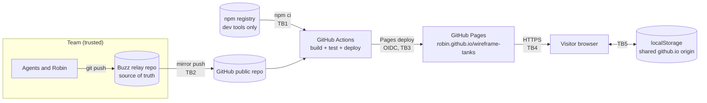

# Wireframe Tanks — threat model

**Author:** Security. **Date:** 2026-10-01. **Inputs:** `docs/IDEA_BRIEF.md`, `docs/RESEARCH_BRIEF.md`, `docs/PRODUCT_BRIEF.md`, scope decision D-41 (public GitHub repo, GitHub Pages, free hobby project).

This threat model is sized for what we are building: a static, single-player browser game with no backend, no accounts and no personal data. The method is STRIDE applied to each trust boundary. The game itself handles almost nothing worth stealing. **The real risk is that someone ships malicious JavaScript from Robin's GitHub Pages origin**, either through a poisoned dependency or through a compromised account or workflow. Most of the controls below are aimed at that.

Requirement IDs (`SEC-n`) are for the Analyst to fold into `REQUIREMENTS.md` and for the Architect and Engineer to design against. Anything that refers to MoSCoW IDs (M12, C1) points at the product brief.

## 1. Assets

| # | Asset | Why it matters |
|---|---|---|
| A1 | Integrity of the deployed site (HTML, JS) | Whatever is served from `<robin>.github.io` runs in every visitor's browser. Tampering turns the game into a malware or phishing page under Robin's name. |
| A2 | Robin's GitHub account and the public repo | The account controls the repo, the Pages site and any other repos Robin owns. |
| A3 | The Buzz relay repo (source of truth) | The team's working copy. The GitHub repo is a mirror of it. |
| A4 | CI credentials | Any token that can push to the mirror or deploy Pages. |
| A5 | Best score in local storage (C1, Could) | Low value. Only matters if we mishandle it when reading it back. |
| A6 | Visitor privacy | The brief promises no tracking and no data leaving the browser (product brief §5, M12). |
| A7 | Robin's reputation and the IP position | Covered by M11 and the research brief §4. Not repeated here. |

There is no personal data, no payment, no login and no server-side state. That removes most of the OWASP Top 10 from scope (no authN/authZ, no SQL, no SSRF, no server-side injection).

## 2. Architecture and trust boundaries

| Boundary | What crosses it | Who is on the other side |
|---|---|---|
| TB1 | Third-party packages (build, test, lint tools) | Package authors and the npm registry |
| TB2 | Commits from the relay into the public GitHub repo | Anyone who can push to GitHub, and the public, who can read everything |
| TB3 | Built artifact into Pages | Whatever code runs in CI, including third-party Actions |
| TB4 | Static files to the visitor | Network, and the host |
| TB5 | Stored best score | The visitor, and **any other page on the same origin** (see T8) |

Note on TB5: a GitHub Pages *project* site is served at `https://<user>.github.io/<repo>/`. Every project site Robin has, or will have, shares the single origin `https://<user>.github.io`. Origins do not include the path, so they all share one `localStorage`.

## 3. Threats (STRIDE)

Risk = likelihood × impact, judged for a free hobby game with a small audience. Ranked highest first.

| # | STRIDE | Threat | Likelihood | Impact | Risk | Mitigation (requirement) |
|---|---|---|---|---|---|---|
| T1 | Tampering | A malicious or hijacked npm package (dev dependency or its install script) runs code on a dev machine or in CI and injects code into the build, or steals the CI token | Low to medium. Supply-chain attacks on popular dev tools happen several times a year | High: malicious JS served to every visitor | **High** | Zero runtime dependencies; minimal, pinned dev dependencies; lockfile; `npm ci`; install scripts off; automated advisories (SEC-1 to SEC-5) |
| T2 | Spoofing / Elevation | Robin's GitHub account is taken over (phished password, stolen session or token) and the site is replaced | Low | High: same as T1, plus every other repo Robin owns | **High** | 2FA with phishing-resistant method, no classic PATs, rulesets on `main` (SEC-10, SEC-11) |
| T3 | Tampering / Elevation | A workflow is abused: a third-party Action is retagged to malicious code, or a fork pull request gets a write token or secrets | Low to medium | High | **Medium** | Pin Actions to full commit SHAs, least-privilege `permissions`, no `pull_request_target`, deploy only from `main` via a protected environment (SEC-6 to SEC-9) |
| T4 | Tampering | A commit lands on GitHub `main` that never went through the team's review on the relay, so the mirror and the source of truth diverge | Low | Medium to high | **Medium** | GitHub `main` accepts pushes only from the mirror identity; the mirror is a one-way push from the relay (SEC-12, SEC-13) |
| T5 | Information disclosure | A secret, private path or private note is published in the public repo or its history | Medium (the docs are written by many agents and mention local paths, Cortex IDs and event IDs) | Low to medium. Nothing secret is in the repo today, but history is permanent once public | **Medium** | Secret scan of full history before the first mirror push and in CI; GitHub secret scanning and push protection; review `docs/` before going public (SEC-14 to SEC-16) |
| T6 | Tampering (XSS) | Text reaches the DOM through `innerHTML` or similar and executes script. In this game the only external input is the stored best score and the URL | Low | Medium: script on the shared `github.io` origin | **Low** | Canvas rendering; `textContent` only; no `eval`/`new Function`; CSP (SEC-17 to SEC-20) |
| T7 | Information disclosure (privacy) | A later change adds a CDN font, analytics or another third-party request, breaking the no-tracking promise | Medium over the life of the project | Low to medium | **Low** | CSP blocks all non-self loads and all `connect`; Tester checks zero requests after load (SEC-17, M12) |
| T8 | Tampering / Disclosure | Another page on the shared `<user>.github.io` origin reads or overwrites our stored best score, or our stored value is crafted by the user | Low | Low: it is a number | **Low** | Namespaced key; validate on read; treat it as untrusted (SEC-21, SEC-22) |
| T9 | Spoofing | Someone hosts a copy of the game with malware, or frames it in their page (clickjacking) | Low | Low: no sensitive action to hijack | **Low, accepted** | GitHub Pages cannot send `X-Frame-Options` or `frame-ancestors` (they are header-only). Accepted as residual risk R2 |
| T10 | Spoofing | A custom domain is added later without verification and is taken over after it lapses | Low | Medium | **Low** (only if a custom domain is used) | Verify the domain in GitHub before pointing DNS; remove DNS records before removing the domain (SEC-23) |
| T11 | Denial of service | The site exceeds GitHub Pages' soft bandwidth limit, or GitHub disables it | Very low at hobby traffic | Low | **Low, accepted** | None needed for the MVP |
| T12 | Repudiation | No record of who changed what | Low | Low | **Low** | Git history plus the relay; Actions logs for deploys. Enough for this project |

## 4. Security requirements

These are the outputs of the threat model. **Must** means the release is blocked without it. **Should** means expected; dropping it needs Robin's acceptance in the release sign-off.

### Supply chain (Engineer, Developer, Architect)

| ID | Requirement | Level | Threat | Verified by |
|---|---|---|---|---|
| SEC-1 | The shipped game has **zero runtime dependencies**. Every file in the deployed artifact is our own code or our own assets. No CDN, no third-party script, font or stylesheet. | Must | T1, T7 | Inspect the build output; CSP (SEC-17) |
| SEC-2 | Dev dependencies are kept to what the stack needs (Architect lists them in `ARCHITECTURE.md`). Each new one is justified in the PR that adds it. | Must | T1 | PR review by Security |
| SEC-3 | `package-lock.json` is committed. CI installs with `npm ci`. Versions are exact or lockfile-pinned. | Must | T1 | CI config |
| SEC-4 | Install scripts are disabled in CI (`npm ci --ignore-scripts`, or `ignore-scripts=true` in `.npmrc`). Packages that genuinely need a post-install step (for example Playwright browser download) get it as an explicit, separate CI step. | Should | T1 | CI config |
| SEC-5 | Dependabot (or equivalent) is on for npm and GitHub Actions. CI runs `npm audit --audit-level=high --omit=dev` as a gate and full `npm audit` as a report. | Must | T1, T3 | Repo settings, CI log |

### CI and deployment (Engineer)

| ID | Requirement | Level | Threat | Verified by |
|---|---|---|---|---|
| SEC-6 | Every third-party Action is pinned to a full 40-character commit SHA, with the version in a comment. Dependabot keeps them current. | Must | T3 | Workflow review |
| SEC-7 | Workflows set `permissions: contents: read` at top level. Only the deploy job gets `pages: write` and `id-token: write`. | Must | T3 | Workflow review |
| SEC-8 | Pages deploys use the official `actions/upload-pages-artifact` and `actions/deploy-pages` flow (OIDC). **No long-lived secret is stored for deployment.** | Must | T3, A4 | Workflow review; Settings → Secrets is empty or justified |
| SEC-9 | Deploy runs only on push to `main`, through the `github-pages` environment restricted to the `main` branch. No `pull_request_target` workflows. Fork PRs from first-time contributors need approval before Actions run (the GitHub default; keep it). | Must | T3 | Repo settings, workflow review |

### Account and repository (Robin, with the Engineer)

| ID | Requirement | Level | Threat | Verified by |
|---|---|---|---|---|
| SEC-10 | Robin's GitHub account has 2FA on, ideally with a passkey or security key. | Must | T2 | Robin confirms |
| SEC-11 | A ruleset on GitHub `main` blocks force pushes and deletion. | Must | T2, T4 | Repo settings |
| SEC-12 | The relay repo is the source of truth. The mirror is a one-way push from the relay to GitHub. Nobody pushes to GitHub `main` directly. | Must | T4 | Runbook, ruleset bypass list |
| SEC-13 | If the mirror is automated, its credential is a **fine-grained token or deploy key scoped to this one repository** with contents write only, held outside the repo, with an expiry. Never a classic PAT, never Robin's password. | Must | T4, A4 | Engineer documents it in `DEPLOY_RUNBOOK.md` (without the secret) |

### Secrets and public exposure (Engineer, everyone)

| ID | Requirement | Level | Threat | Verified by |
|---|---|---|---|---|
| SEC-14 | Before the **first** push to the public GitHub repo, the full history is scanned with a secret scanner (for example gitleaks) and the result is attached to the PR or runbook. Anything found is removed by rewriting history *before* publishing, then rotated. | Must | T5 | Scan output |
| SEC-15 | The same secret scan runs in CI on every push. GitHub secret scanning and push protection are enabled (free for public repos). | Must | T5 | CI log, repo settings |
| SEC-16 | Before going public, someone reads `docs/` for anything Robin would not want published. Today's docs contain local paths (`C:\Users\Robin\...`), Cortex and Buzz event IDs, and the trademark analysis. I judge these acceptable, but publishing them is Robin's call at the deploy gate. | Should | T5 | Robin at the deploy gate |

### Browser (Developer, Architect)

| ID | Requirement | Level | Threat | Verified by |
|---|---|---|---|---|
| SEC-17 | `index.html` sets a Content Security Policy with a `<meta http-equiv="Content-Security-Policy">` tag, placed before any script. GitHub Pages cannot set custom response headers, so the meta tag is the only option. Starting policy: `default-src 'self'; script-src 'self'; style-src 'self'; img-src 'self' data:; font-src 'self'; connect-src 'none'; object-src 'none'; base-uri 'none'; form-action 'none'` `connect-src 'none'` also enforces M12 (no network calls after load). Any relaxation needs a reason in the PR. | Must | T6, T7 | Playwright check: no CSP violations in the console; header present in the built `index.html` |
| SEC-18 | No inline scripts, no inline event handlers, no inline `style` attributes in the shipped HTML, so the CSP needs no `'unsafe-inline'`. (Setting `element.style.x` from JS is fine; CSP does not block it.) | Must | T6 | Build output review, CSP check |
| SEC-19 | No `eval`, `new Function`, `setTimeout` with a string, `innerHTML`, `outerHTML`, `insertAdjacentHTML` or `document.write`. Any DOM text uses `textContent`. Lint rules enforce this. | Must | T6 | ESLint rules (`no-eval`, `no-implied-eval`, `no-new-func`, and a `no-restricted-properties`/`no-restricted-syntax` rule for the HTML sinks) in CI |
| SEC-20 | `<meta name="referrer" content="no-referrer">` is set. The game reads nothing from the URL (query string or hash) in the MVP. If that changes, the input is parsed as data, never as HTML or code. | Should | T6, T7 | Review |
| SEC-21 | The best-score key in `localStorage` is namespaced (for example `wireframe-tanks:best-score`), because the origin is shared with every other Pages project site on Robin's account. | Should (applies only if C1 is built) | T8 | Unit test |
| SEC-22 | The stored best score is treated as untrusted on read: parse as a number, accept it only if it is a finite, non-negative integer below a sane cap, otherwise ignore it. Storage errors (private mode, quota, disabled storage) are caught and the game still runs. | Should (applies only if C1 is built) | T8 | Unit tests for bad values and a throwing `localStorage` |

### Hosting (Engineer)

| ID | Requirement | Level | Threat | Verified by |
|---|---|---|---|---|
| SEC-23 | "Enforce HTTPS" is on in Pages settings. If a custom domain is ever added, it is verified in GitHub account settings first. | Must (HTTPS) / Should (domain) | T4, T10 | Repo settings |

## 5. What a public repo exposes

Robin chose a public repo (D-41). For completeness, this is what becomes public:

- **All source and all of `docs/`**, including the full git history from the first commit. Deleting a file later does not remove it from history or from forks and caches.
- **Commit author names and emails.** Today they are the agents' Buzz identities (`<pubkey>@<relay host>`), which are already public on the relay. If Robin commits, his GitHub noreply address should be used (GitHub → Settings → Emails → "Keep my email addresses private").
- **The Buzz relay host name** appears in author emails. It is not a secret.
- **The CI configuration**, which is fine as long as SEC-6 to SEC-9 hold. Workflow logs on public repos are public too, so nothing secret should ever be echoed.

None of this needs to change the decision. SEC-14 to SEC-16 are the controls.

## 6. Residual risks (accepted for the MVP)

| # | Risk | Severity | Why accepted |
|---|---|---|---|
| R1 | A supply-chain compromise of a dev tool before advisories catch it | Medium | Reduced by SEC-1 to SEC-6, but no project can eliminate it. Zero runtime dependencies keep the blast radius to build time. |
| R2 | The game can be framed by another site (no `frame-ancestors` on Pages) | Low | Nothing in the game is worth clickjacking: no login, no purchase, no data. |
| R3 | The shared `<user>.github.io` origin: a flaw in any other Pages site of Robin's could touch our storage, and ours theirs | Low | We store only a number and validate it (SEC-21, SEC-22). A custom domain would remove this if it ever matters. |
| R4 | Players can edit their own best score | Low | It is local only and there is no leaderboard. |

## 7. Out of scope, and when to revisit

This model covers the MVP only. **Revisit it before Phase 2 work starts**, in particular before:

- **Multiplayer** (Phase 2.3): it brings a server, a network protocol and untrusted input from other players. That is a new threat model (authentication, cheating, abuse, DoS, hosting secrets), not an update to this one.
- **Any online leaderboard, accounts or analytics**: they bring personal data and GDPR questions.
- **Charging or adverts**: third-party ad scripts would break SEC-1 and SEC-17, and GitHub Pages' terms no longer fit (research §8).
- **A custom domain** (T10, R3).

## 8. Review plan

- **Design gate:** Analyst folds SEC-1 to SEC-23 into `REQUIREMENTS.md` as NFRs; Architect reflects SEC-1, SEC-17 to SEC-19 in `ARCHITECTURE.md`; Engineer takes SEC-3 to SEC-15 and SEC-23 into the CI and runbook plan.
- **Build:** Security reviews every PR, with particular attention to new dependencies, workflow files and any DOM or storage code.
- **Verify:** Tester runs the CSP and network checks (SEC-17, M12). Security runs the secret scan and dependency audit.
- **Release-ready:** Security writes the sign-off with the residual risks above, updated.
