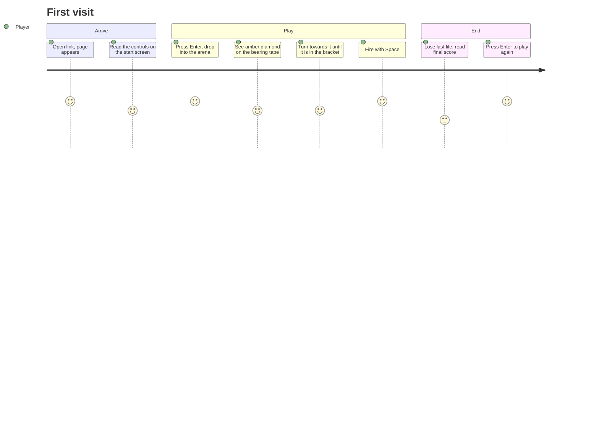
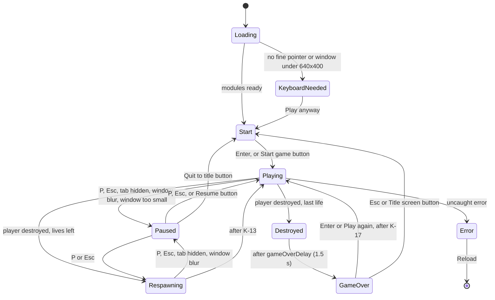

# Wireframe Tanks — UX spec

**Author:** Designer. **Date:** 2026-10-01. **Stage:** Requirements and Design (merged).
**Inputs:** `docs/PRODUCT_BRIEF.md` (at `260b20a`), `docs/REQUIREMENTS.md` (at `34cab00`), `docs/RESEARCH_BRIEF.md`, `docs/ARCHITECTURE.md` and ADRs (at `e5e4cec`), `docs/TEST_STRATEGY.md`, `docs/THREAT_MODEL.md`.
**Mockup:** `docs/ux/mockup.html`. Open it in a browser and switch screens with the URL hash (`#start`, `#play`, `#model`, `#grace`, `#aiming`, `#play-left`, `#enemy-fire`, `#reloading`, `#hit`, `#paused`, `#gameover`, `#unsupported`, `#error`). It is a design reference only and is never shipped. Rendered screenshots of every screen at 1280 × 720 are in `docs/ux/screens/`.

This spec uses the Analyst's IDs from `REQUIREMENTS.md`: screens, business rules (BR-nn), constants (K-nn) and stories (US-nn). Where the two documents disagreed (test strategy §10.8, X1–X6), the Manager ruled for this spec on X1–X5 on 2026-10-01 and Product accepted the extra screens as MVP scope; the Analyst is updating BR-18, BR-20, AC-09.4, AC-14.1 and the screen list to match. X6 is settled in §6.5. Game numbers live in `config.js`; where a number appears in braces, such as `{lives}`, it is the K-value from there. Section 14 maps every story to this spec.

## 1. Design decisions

| # | Question | Decision | Why |
|---|---|---|---|
| UX-D1 | T6 / ADR 0005: screens in HTML or on the canvas? | **HTML over the canvas** for the Start, Paused and Game over screens, plus the error and "keyboard needed" notices. Play view and HUD on the canvas. | Real text, focus order and automated axe checks for every screen with words on it. The HUD is a handful of short readouts, so the live region in §9 carries its meaning to assistive technology. |
| UX-D2 | Enemy locator form (M8) | **Bearing tape** along the bottom centre, plus an **edge chevron** when the enemy is out of view. | The tape answers "which way and how far" in one glance, and the chevron points at the turn. A circular radar is the original game's device, so we avoid it (§7.7). |
| UX-D3 | Arena edge (BR-05, AC-05.7, requirements Q4) | **Bounded**, shown by a low fence of posts and a rail. | It agrees with BR-05 and Architect §5.5. Wrapping is invisible in first person and makes the locator lie about distance. |
| UX-D4 | Lettering | **System monospace font** for HTML and canvas `fillText`. No vector lettering, no web fonts. | Original by construction, zero bytes, legible, and it satisfies SEC-1. |
| UX-D5 | Colour | **Cyan world, amber enemy, near-white HUD on near-black.** | Avoids the original's green-and-red overlay look. Cyan against amber differs in hue for the common colour-vision types, and the enemy also differs in shape (§8.3). |
| UX-D6 | Field of view | **40° vertical** (about 66° horizontal at 16:9). | It shows the enemy at a readable size at 50 u and gives enough side view to steer round obstacles. Architect's projection uses vertical FOV (§5.1); the value goes in `config.js`. |
| UX-D7 | Starting and restarting (X1, X2) | **Enter**, or Space/Enter on the focused button. Other keys do nothing on Start and Game over. Game over has a K-17 (1.0 s) lockout, made visible: the prompt and buttons appear only when keys work again. | "Any key" would catch screen-reader, browser and mute keys. A player hammering Space when they die must not skip their final score. |
| UX-D8 | Obstacle layout (BR-06) | The fixed 12-obstacle layout in §7.5. | BR-06 gives the layout to the Designer. |

## 2. Users and journeys

Personas come from product brief §3: the **casual desktop player** (primary) and the **retro-arcade fan** (secondary).

### J1 — First-time casual player: link to first shot in under 30 seconds (metric 2)



What must be true: the controls are on the start screen (M1), the first enemy is findable without spinning (M8), and the first shot needs no reading beyond the start screen.

### J2 — Retro fan chasing a score

Plays several games in a row. Needs restart without a page reload (metric 5), a visible best score (C1), and a difficulty rise they can feel (S3). Wants crisp motion, so the HUD stays out of the centre of the view.

### J3 — Interrupted player

Switches tab or gets a call. The game pauses itself on blur (S4) and shows the pause screen on return, so nothing happens while they are away. Resume puts them back exactly where they were.

### J4 — Player who needs quiet or less motion

Presses M to mute (S2) and sees the state in the HUD. With `prefers-reduced-motion: reduce` set, the hit shake and the warning pulse are replaced by static cues (§9).

### J5 — Player with a non-QWERTY keyboard

Keys are read by physical position (`KeyboardEvent.code`), so on AZERTY the drive keys sit where W A S D are on QWERTY. The start screen shows the QWERTY letters plus the arrow keys, which are the same everywhere.

## 3. Information architecture

One page, no navigation, no URLs per screen (SEC-20: the game reads nothing from the URL).

| Layer | Contents |
|---|---|
| Canvas (always present) | Play view (world, enemy, shells) and HUD |
| HTML overlay (one at a time) | Start, Paused, Game over, Keyboard needed, Error. Respawning has no overlay; it is a HUD banner (§5.3). |
| Live region (visually hidden) | Short announcements of state changes (§9) |
| `<noscript>` | "JavaScript needed" message |

## 4. Screen flow

This extends requirements §8.1 with the states ruled in scope under X5: Loading, Keyboard needed, Error, Quit to title, Esc to title from Game over, and auto-pause when the window is too small.



`Destroyed` can be the Analyst's Respawning screen with a different duration and end state, or a separate state; that is a modelling choice for the Analyst and Architect. What the player sees is §5.4.

### 4.1 Keys by screen

| Key (`code`) | Start | Playing / Respawning | Paused | Game over |
|---|---|---|---|---|
| `Enter` | Start game | — | Activates a focused button, if the player tabbed to one | Play again (after K-17) |
| `Space` | Activates the focused Start button | Fire, once per press (BR-01) | Nothing, unless a button has focus (AC-10.6) | Activates the focused button (after K-17) |
| `KeyW` `KeyS` `KeyA` `KeyD`, arrows | Nothing | Drive and turn (ignored while Respawning) | Nothing (AC-10.6) | Nothing |
| `KeyP` | Nothing | Pause | Resume | Nothing |
| `Escape` | Nothing | Pause | Resume | Title screen |
| `KeyM` | Toggle sound | Toggle sound | Toggle sound | Toggle sound |
| `Tab` | Browser default | — | Moves between Resume and Quit to title | Browser default (after K-17) |

- Fire is once per key press: one shell in flight and a K-26 (0.5 s) reload (BR-01, BR-08, Product D-83).
- While playing, game keys do not trigger browser defaults (BR-01), so Space and the arrows never scroll. Overlays leave Tab and Enter alone.
- The mute state lasts for the session only (BR-23).

## 5. Wireframes

The mockup renders all of these at 1280 × 720. ASCII versions are below for review without a browser.

### 5.1 Loading and start (M1)

`index.html` contains the Start overlay as static HTML, so it appears with the first paint. Until `main.js` is ready, the button is disabled and reads "Loading…", and keys do nothing. Then it reads "Start game", becomes active and takes focus, so Enter and Space both start (X1).

```text
+------------------------------------------------------------------+
|                (dimmed arena drawn behind, no HUD)               |
|                                                                  |
|                        WIREFRAME TANKS                           |
|          One tank. One rival. Find it before it finds you.       |
|                                                                  |
|                 Drive   [W] [S]  or  [↑] [↓]                     |
|                 Turn    [A] [D]  or  [←] [→]                     |
|                 Fire    [Space]                                  |
|                 Pause   [P]  or  [Esc]                           |
|                 Sound   [M]                                      |
|                                                                  |
|                       [  Start game  ]   <- focused              |
|                        or press [Enter]                          |
|                       Best score 1200    <- only if one exists   |
+------------------------------------------------------------------+
```

The background is the arena at the start position, drawn once and dimmed by the overlay. A slowly turning camera (one revolution per 60 s, still under reduced motion) is polish and sits with the Could items (Product).

### 5.2 Playing — HUD layout (M2, M4, M8, M9)

```text
+------------------------------------------------------------------+
| SCORE 300                                            BEST 1200   |
| LIVES 3 /\ /\ /\                           P PAUSE   M SOUND ON  |
|                                                                  |
|        ____                                                      |
| <      |  |   ___/‾‾‾‾\___        ( · )        ___/‾‾‾‾‾\___     |  <- horizon line and ridge
| ^      |  |    X              [enemy, amber]                     |
| edge   |__|                                                      |
| chevron                                                          |
| (only if enemy                                                   |
|  out of view)                                                    |
|              |----+----+----|  ◆  |----+----+----|               |  <- bearing tape
|                              ^                                   |
|                            49 m                                  |
+------------------------------------------------------------------+
```

| Element | Position | Notes |
|---|---|---|
| Score | Top left, 24 px in, baseline 36 px | Label `SCORE` in dim, value in HUD colour, 20 px (AC-09.1) |
| Lives | Under score, baseline 62 px | Number plus one outline triangle per life. The number means the count never depends on reading the icons. |
| Best score (US-15) | Top right | Hidden while the best score is 0, which includes missing or invalid storage (AC-15.3, AC-15.4). Never shows "BEST 0". |
| Key hints | Under best score | `P PAUSE   M SOUND ON` / `M SOUND OFF`. Doubles as the mute indicator. |
| Crosshair | Exact centre | §6.3 |
| Bearing tape | Bottom centre, 56 px above the bottom edge | §6.4 |
| Edge chevron | Left or right edge, vertical centre | §6.5 |
| Banner | Centre, 32% from top | Transient messages (§6.6) |

Nothing is drawn in a band of ±60 px around the horizon except the crosshair, so the world stays readable where the action is.

### 5.3 Respawning: player destroyed, lives left (BR-13, US-14, X4)

```text
+==================================================================+  <- alert-colour frame, 400 ms, shown once
||                                                                ||
||                  HIT · 2 LIVES LEFT                            ||  <- banner, alert colour, for all of K-13
||                                                                ||
||                         ( · )                                  ||
||          view shakes for 250 ms (off with reduced motion)      ||
||              tape reads SCANNING (enemy removed, AC-08.3)      ||
+==================================================================+
```

The banner stays for the whole Respawning time (K-13, 2.0 s), while drive and fire keys are ignored. It clears when the player reappears at the centre. The frame and shake durations are named constants (`hitFrameMs` 400, `hitShakeMs` 250) so Product can tune them in the play test.

### 5.4 Destroyed: last life lost (X3)

Same frame and shake, banner `DESTROYED`. After `gameOverDelay` (1.5 s, a named constant) the Game over overlay opens.

### 5.5 Paused (US-10)

```text
+------------------------------------------------------------------+
|           (frozen frame with HUD, under a dark overlay)          |
|                             PAUSED                               |
|                       [    Resume     ]                          |
|                       [ Quit to title ]                          |
|                 Press P or Esc to resume                         |
+------------------------------------------------------------------+
```

- The overlay is a `role="dialog"` with `aria-modal="true"`, labelled by its heading. When it opens, focus goes to the dialog itself (`tabindex="-1"`), **not** to a button. So Space and the drive keys do nothing (AC-10.6) unless the player deliberately tabs to a button.
- Quit to title ends the game without recording a score and opens Start (X5).
- If the pause was caused by the window being too small, a line is added above the buttons: "Make the window larger to keep playing." Resume, P and Esc do nothing until the window is big enough again.

### 5.6 Game over (US-09, US-15)

```text
+------------------------------------------------------------------+
|                           GAME OVER                              |
|                              1400                                |
|                     Best 1400 · New best score   <- US-15        |
|                                                                  |
|              [ Play again ]  [ Title screen ]    <- after K-17   |
|                        or press [Enter]          <- after K-17   |
+------------------------------------------------------------------+
```

- For K-17 (1.0 s) the buttons and the prompt are hidden and keys are ignored (BR-20). Then they appear together, and focus moves to "Play again" (X2).
- Esc, or the Title screen button, opens Start.
- The best line shows `Best {best}` alongside the final score (AC-15.2). "New best score" is added only when this game set it. If US-15 is not built, the line is left out.

### 5.7 Keyboard needed

A UI-only notice, not a game screen. Shown instead of the Start screen when `matchMedia('(any-pointer: fine)')` is false or the window is under 640 × 400. It is advice, not a block.

```text
                         Keyboard needed
   Wireframe Tanks is played with a keyboard on a screen at least
   640 × 400 pixels. Touch controls are not available yet.
                         [ Play anyway ]
```

### 5.8 Error

Shown by the global error handler (Architect §6.5). No stack trace or technical detail on screen; that goes to the console.

```text
                       Something went wrong
       The game stopped unexpectedly. Reload the page to play again.
                           [ Reload ]
```

### 5.9 No JavaScript

`<noscript>`: "Wireframe Tanks needs JavaScript. Turn it on and reload the page."

## 6. HUD components

All HUD geometry is in CSS pixels, built by `hud.js` as 2D segments and text items.

### 6.1 Score and lives

- Plain integers, no leading zeros, no thousands separator (scores stay short).
- On a kill, the score updates at once. The `+{points}` banner (§6.6) explains the jump.

### 6.2 Best score (US-15)

Read once at start. Updated when a game ends with a higher score (AC-15.1). Invalid values count as 0 (AC-15.3), and storage errors are silent to the player (AC-15.4).

### 6.3 Crosshair (M4)

| State | Drawing |
|---|---|
| Ready to fire | Four arcs of a 36 px circle with 0.25 rad gaps at 0°, 90°, 180°, 270°, 2 px, HUD colour, plus a 5 px filled centre dot |
| Cannot fire: shell in flight (BR-08) or within K-26 of the last shot | Same circle dashed (3 on, 5 off), HUD-dim colour, no centre dot |

The change is shape (dashed, no dot) as well as colour, so it reads without colour vision.

### 6.4 Bearing tape (M8)

- **Size:** width `min(480 px, 60% of viewport width)`, centred. Baseline 2 px, HUD-dim.
- **Scale:** left end is −180° (directly behind, turning left), centre is straight ahead, right end is +180°. Ticks every 45°: 20 px tall at 0°, ±90° and ±180°, 12 px otherwise.
- **View bracket:** two 28 px vertical lines in HUD colour at ± half the horizontal field of view, so the player can see when the enemy will be on screen.
- **Heading notch:** a small upward caret under the centre.
- **Enemy marker:** filled amber diamond, 14 × 18 px, at `x = centre + (relativeBearing / 180°) × halfWidth`. Directly behind (±180°) it sits at the end on the side the AI is moving towards; if that is unknown, the right end.
- **Range:** under the caret, `{n} m`, the distance in arena units rounded to a whole number (1 u is about a metre, requirements §1), 14 px, HUD colour.
- **No enemy** (K-14 after a kill, and during Respawning): no marker, range reads `SCANNING` (AC-08.3).
- **Behind (AC-08.2):** a marker at either end of the tape means behind; a marker near the centre means in front. The two can never be confused because they are at opposite ends of the tape.
- **New enemy (AC-11.3):** the marker appears and `SCANNING` is replaced by the range. That is the visual pair of the spawn sound (NFR-17).
- **Enemy aiming (warning):** from the "enemy starts aiming" event until it fires or stops aiming, an amber ring (2 px, 13 px radius) is drawn round the marker. It pulses (visible 250 ms, hidden 250 ms, 2 Hz) unless reduced motion is set, in which case it is steady.
- **Accuracy (AC-08.1, AC-08.4):** the marker uses the current frame's heading; at 480 px wide, 1 px is 0.75°, well inside ±5°.
- **Phase 2 note:** with more than one enemy, each gets a marker and the range shows the nearest. Not built now.

### 6.5 Edge chevron (M8)

When `|relativeBearing|` is more than half the horizontal FOV, an amber chevron (14 × 44 px, 4 px stroke) is drawn 28 px from the left or right edge at vertical centre, pointing outwards on the shorter turning side. It disappears as soon as the enemy is inside the view.

**Enemy fires while out of view (X6, NFR-17):** the chevron switches to the alert colour and an 8 px stroke for 300 ms, once per shot, then returns to normal. The enemy's reload is at least 2.0 s (difficulty table), so this is at most one flash every 2 s (NFR-14). When the enemy is in view its shell is visible instead, and the chevron is not shown.

### 6.6 Banner messages

| Trigger | Text | Colour | Duration |
|---|---|---|---|
| Enemy destroyed | `+{points}` (K-09) | HUD | 1000 ms |
| Player destroyed, lives left | `HIT · {n} LIVES LEFT` (`HIT · 1 LIFE LEFT` for one) | Alert | All of Respawning (K-13) |
| Player destroyed, no lives left | `DESTROYED` | Alert | `gameOverDelay` (1.5 s) |
| Difficulty step (S3) | none | — | The rising difficulty is felt, not announced, to keep the HUD quiet |

28 px, letter-spacing 0.1 em, centred. One banner at a time; a newer one replaces an older one.

### 6.7 Debug overlay

Architect's debug overlay (frame time, segment count) draws top centre, in HUD-dim at 12 px, so it never covers the score or the locator. It is a developer tool, so it is exempt from this spec's copy rules.

## 7. Line art (M2, M5, M6, M11, P4)

### 7.1 Conventions

- Model space in arena units (u, treated as metres): **+x right, +y up, +z forward** (the way the model faces). The origin is on the ground at the model's centre.
- Yaw: positive yaw turns clockwise seen from above (from +z towards +x), matching the requirements' headings (clockwise from +Z, requirements §1). A world point is `(ox + x·cos θ + z·sin θ, y, oz − x·sin θ + z·cos θ)`.
- Shells fly at 1.6 u, the barrel height. Eye height is 2.2 u.
- Edges are index pairs into `vertices`.

### 7.2 Models for `models.js`

Exported from `docs/ux/mockup.html` (rounded to 1 mm). The mockup builds them from a few helpers; these literal lists are what `models.js` should contain.

```js
  // Enemy tank, "hex hull": chamfered six-sided hull with sloped sides, wedge turret,
  // twin short barrels, whip antenna. 6 m long, 3.6 m wide, 3.4 m to the antenna tip. 33 edges.
  tank: {
    vertices: [[-1,0.3,3],[1,0.3,3],[1.8,0.3,1.6],[1.8,0.3,-2.8],[-1.8,0.3,-2.8],[-1.8,0.3,1.6],[-0.85,1.2,2.55],[0.85,1.2,2.55],[1.53,1.2,1.36],[1.53,1.2,-2.38],[-1.53,1.2,-2.38],[-1.53,1.2,1.36],[-1,1.2,-1.4],[1,1.2,-1.4],[1,1.2,0.8],[-1,1.2,0.8],[-0.6,2,-1.2],[0.6,2,-1.2],[0.6,2,0.2],[-0.6,2,0.2],[-0.3,1.6,0.5],[-0.3,1.6,3.8],[0.3,1.6,0.5],[0.3,1.6,3.8],[-0.5,2,-1],[-0.5,3.4,-1.3]],
    edges: [[0,1],[6,7],[0,6],[1,2],[7,8],[1,7],[2,3],[8,9],[2,8],[3,4],[9,10],[3,9],[4,5],[10,11],[4,10],[5,0],[11,6],[5,11],[12,13],[16,17],[12,16],[13,14],[17,18],[13,17],[14,15],[18,19],[14,18],[15,12],[19,16],[15,19],[20,21],[22,23],[24,25]],
  },
  // Hexagonal pillar, 2.5 m radius, 7 m tall. 18 edges.
  pillar: {
    vertices: [[2.165,0,1.25],[0,0,2.5],[-2.165,0,1.25],[-2.165,0,-1.25],[0,0,-2.5],[2.165,0,-1.25],[2.165,7,1.25],[0,7,2.5],[-2.165,7,1.25],[-2.165,7,-1.25],[0,7,-2.5],[2.165,7,-1.25]],
    edges: [[0,1],[6,7],[0,6],[1,2],[7,8],[1,7],[2,3],[8,9],[2,8],[3,4],[9,10],[3,9],[4,5],[10,11],[4,10],[5,0],[11,6],[5,11]],
  },
  // Long wall slab, 12 x 3 x 1 m, with two panel joints on each long face. 16 edges.
  wall: {
    vertices: [[-6,0,-0.5],[6,0,-0.5],[6,0,0.5],[-6,0,0.5],[-6,3,-0.5],[6,3,-0.5],[6,3,0.5],[-6,3,0.5],[-2,0,-0.5],[-2,3,-0.5],[2,0,-0.5],[2,3,-0.5],[-2,0,0.5],[-2,3,0.5],[2,0,0.5],[2,3,0.5]],
    edges: [[0,1],[4,5],[0,4],[1,2],[5,6],[1,5],[2,3],[6,7],[2,6],[3,0],[7,4],[3,7],[8,9],[10,11],[12,13],[14,15]],
  },
  // Tank trap ("hedgehog"): three crossed beams, about 2.9 m tall. 12 edges.
  hedgehog: {
    vertices: [[-1.796,0.003,0.175],[-1.796,0.003,-0.175],[1.796,2.877,-0.175],[1.796,2.877,0.175],[0.744,0.006,-1.646],[1.048,0.006,-1.472],[-0.744,2.874,1.646],[-1.048,2.874,1.472],[1.048,0.006,1.472],[0.744,0.006,1.646],[-1.048,2.874,-1.472],[-0.744,2.874,-1.646]],
    edges: [[0,1],[1,2],[2,3],[3,0],[4,5],[5,6],[6,7],[7,4],[8,9],[9,10],[10,11],[11,8]],
  },
  // Shell: elongated octahedron, 0.6 m across, nose 0.6 m forward. Placed at y = 1.6. 12 edges.
  shell: {
    vertices: [[0.3,0,0],[-0.3,0,0],[0,0.3,0],[0,-0.3,0],[0,0,0.6],[0,0,-0.3]],
    edges: [[0,2],[0,3],[0,4],[0,5],[1,2],[1,3],[1,4],[1,5],[2,4],[4,3],[3,5],[5,2]],
  },
```

The player's own tank is never seen in first person, so it has no model. The lives icon (§5.2) is a plain triangle, not a tank silhouette.

### 7.3 Obstacle footprints

Tank hit and collision size is K-07 (3 u); the requirements number governs, and the earlier 2.2 u suggestion is withdrawn. The tank model is 6 × 3.6 u, so it sits inside that circle. Obstacle footprints, taken from the art, for `config.js` or `models.js`:

| Model | Footprint |
|---|---|
| Pillar | Circle, 2.5 u radius |
| Wall | Rectangle, 12 × 1 u, rotated with the obstacle's yaw |
| Hedgehog | Circle, 1.9 u radius |

### 7.4 Arena, horizon and scenery

- **Horizon line (M2):** one full-width line at eye level, horizon colour.
- **Fence (UX-D3, AC-05.7):** built from the config value, not fixed numbers: a post every 25 u along the boundary at ±K-01 (±250 u today), 1.5 u tall, joined by a rail at 1.5 u. World colour. At K-01 = 250 that is 80 posts and 80 rail sections (posts = 8 × K-01 / 25; if K-01 is not a multiple of 25, space the posts evenly at the nearest spacing to 25 u); scene culling keeps the drawn count low. Because tanks stop K-07 short of the boundary, the fence is always at least 3 u ahead when the player is against it, so it stays visible.
- **Ridge (C2, Could):** a distant line of flat-topped mesas at infinity, so it turns with the view but never gets closer. Points are `[bearing° clockwise from +z, elevation° above the horizon]`, joined in order:

```js
  ridge: [[0,0],[12,0],[14,2.2],[24,2.2],[26,0],[60,0],[63,1.4],[66,1.7],[70,1.4],[73,0],[140,0],[143,3],[150,3],[152,2],[160,2],[162,0],[220,0],[224,1.8],[236,1.8],[240,0],[300,0],[302,1.2],[318,1.2],[320,0],[345,0],[347,2.6],[352,2.6],[354,0],[360,0]],
```

  Screen position: `x = w/2 + f·tan(bearing − yaw)` for points within ±80° of the view direction, `y = h/2 − f·tan(elevation)`.

### 7.5 Obstacle layout (BR-06, K-22, K-24)

Twelve obstacles, the same every game. Positions are `(x, z)` in u; yaw in degrees clockwise.

| # | Model | x | z | Yaw |
|---|---|---|---|---|
| 1 | pillar | 0 | 45 | 0 |
| 2 | hedgehog | −30 | 25 | 20 |
| 3 | wall | 40 | 20 | 60 |
| 4 | hedgehog | 25 | −40 | 45 |
| 5 | pillar | −55 | −30 | 0 |
| 6 | wall | −20 | −70 | 0 |
| 7 | pillar | 80 | 90 | 0 |
| 8 | hedgehog | −90 | 80 | 10 |
| 9 | wall | 110 | −60 | 90 |
| 10 | pillar | −120 | −110 | 0 |
| 11 | wall | −140 | 20 | 30 |
| 12 | hedgehog | 150 | 160 | 70 |

Checked with a script against bounding circles (wall counted as a 6.05 u circle):

- Nearest footprint to the centre is 37.2 u away, well clear of K-22 (20 u) (AC-05.6).
- Smallest gap between any two obstacles is 31.7 u, against a tank width of 6 u, so every open area is reachable (BR-06).
- Every footprint is at least 90 u inside the boundary.

The first pillar stands straight ahead of the spawn heading, so a new player sees an obstacle in the first frame and learns what the lines mean. The mockup uses this layout.

### 7.6 Enemy states in the art

| State | Drawing |
|---|---|
| Grace period, K-12 (BR-15) | Enemy drawn **dashed** (6 on, 4 off) in amber: visibly "not yet armed". Needs one extra stroke style in the renderer palette (`enemyGrace`). |
| Normal | Solid amber, 2 px |
| Destroyed | Disappears at once. With US-18, its edges fly apart as fragments for 800 ms, fading out, no flashing (AC-18.1, AC-18.2). |

### 7.7 Originality checklist (M11, NFR-10, NFR-11)

Tester can use this list for the MAN-IP review (NFR-11). Our design must **not** contain:

- the word "Battlezone" anywhere (title, metadata, copy, file names, comments in shipped files);
- pyramids or cubes as obstacles;
- a volcano, crescent moon or jagged mountain range on the horizon;
- a circular radar with a sweep at the top of the screen;
- a cracked-glass effect when the player is hit;
- the text messages "ENEMY IN RANGE", "ENEMY TO LEFT", "ENEMY TO RIGHT" or "ENEMY TO REAR";
- a red band across the top of the screen or a green-on-black colour scheme;
- a tank with a single long barrel and a radar dish;
- lettering copied from the original or any vector font derived from it.

## 8. Design tokens

Tokens live as CSS custom properties in `styles.css`. The canvas palette is read from the same properties once at start-up (`getComputedStyle(document.documentElement)`), so there is one source of truth (Architect §6.7).

### 8.1 Colour

Contrast measured against `--wt-color-bg` with the WCAG relative-luminance formula.

| Token | Value | Use | Contrast on bg |
|---|---|---|---|
| `--wt-color-bg` | `#070A12` | Page and canvas background | — |
| `--wt-color-overlay` | `rgba(7, 10, 18, 0.88)` | Behind HTML overlays | — |
| `--wt-color-world` | `#3FC9DB` | Obstacles, fence, player shells, primary button fill | 10.0:1 |
| `--wt-color-horizon` | `#2F9FB0` | Horizon line and ridge | 6.3:1 |
| `--wt-color-enemy` | `#FFB547` | Enemy tank, enemy shells, locator marker, chevron | 11.3:1 |
| `--wt-color-text` | `#E3F6F8` | HUD values, crosshair, overlay text | 17.7:1 |
| `--wt-color-text-dim` | `#8FB3BC` | HUD labels, hints, tape baseline, reloading crosshair | 8.8:1 |
| `--wt-color-alert` | `#FF6B81` | Hit frame, HIT and DESTROYED banners | 7.2:1 |
| `--wt-color-focus` | `#FFE066` | Keyboard focus ring | 15.2:1 |

- Button text `#070A12` on `--wt-color-world`: 10.0:1.
- Worst-case text over the overlay (overlay on top of an amber line): text 14.6:1, dim text 7.3:1, alert 6.0:1.
- Every pair passes 4.5:1 for text and 3:1 for graphics (WCAG 1.4.3, 1.4.11).

### 8.2 Canvas palette mapping

| Palette key | Token | Line width |
|---|---|---|
| `background` | `--wt-color-bg` | — |
| `horizon` | `--wt-color-horizon` | 1.5 px |
| `world` | `--wt-color-world` | 1.5 px |
| `playerShell` | `--wt-color-world` | 1.5 px |
| `enemy`, `enemyShell` | `--wt-color-enemy` | 2 px |
| `enemyGrace` | `--wt-color-enemy`, dashed 6/4 | 2 px |
| `hud` | `--wt-color-text` | 2 px |
| `hudDim` | `--wt-color-text-dim` | 2 px |
| `alert` | `--wt-color-alert` | 10 px (hit frame) |

Line widths are CSS pixels; the renderer scales the canvas by `devicePixelRatio` so lines stay crisp on high-density screens.

### 8.3 Colour and colour vision

The enemy differs from the world in hue (amber against cyan), in line weight (2 px against 1.5 px) and in shape. Luminance alone barely separates them (1.1:1), so colour is never the only cue: the locator marker, chevron and crosshair states all change shape too.

### 8.4 Type

| Token | Value | Use |
|---|---|---|
| `--wt-font` | `ui-monospace, "Cascadia Mono", Consolas, Menlo, "DejaVu Sans Mono", monospace` | Everything |
| `--wt-text-sm` | `0.875rem` (14 px) | Hints, HUD labels, range |
| `--wt-text-md` | `1rem` (16 px) | Body text in overlays |
| `--wt-text-lg` | `1.25rem` (20 px) | Buttons, HUD values |
| `--wt-text-xl` | `1.75rem` (28 px) | Overlay headings, banners |
| `--wt-text-title` | `clamp(2rem, 6vw, 3.5rem)` | Game title, final score |

HTML text uses `rem`, so browser text zoom works. Canvas text uses fixed pixel sizes from the same scale. Headings and HUD labels are upper case with 0.05–0.12 em letter-spacing; sentences are in sentence case.

### 8.5 Spacing

4 px base: `--wt-space-1` 4, `-2` 8, `-3` 12, `-4` 16, `-6` 24, `-8` 32, `-12` 48 px. HUD safe margin is 24 px from the left and right edges and 16 px from the top.

### 8.6 Motion

| Constant or token | Value | Use | Reduced motion |
|---|---|---|---|
| `hitFrameMs` | 400 ms | Alert frame on a hit, shown once (X4) | Unchanged (not motion) |
| `hitShakeMs` | 250 ms, 6 px | View shake on a hit (X4) | Off (NFR-16, AC-14.3) |
| `pointsBannerMs` | 1000 ms | `+{points}` banner | Unchanged |
| `gameOverDelay` | 1500 ms | `DESTROYED` banner before Game over (X3) | Unchanged |
| K-17 | 1000 ms | Game over input lockout | Unchanged |
| `aimPulseMs` | 500 ms period | Enemy aiming ring | Steady ring |
| `enemyShotFlashMs` | 300 ms | Edge chevron when an out-of-view enemy fires (X6) | Unchanged (one flash, no motion) |
| `--wt-duration-attract` | 60 s per turn | Start screen camera (Could) | Still |

The millisecond values are UI constants for `config.js` next to the K-values; the CSS duration token covers the one effect that lives in HTML.

## 9. Accessibility (WCAG 2.2 AA)

A real-time first-person shooter cannot be played without sight, and the scope does not ask for that. What we can and must do is make every screen with words on it fully accessible, make the game playable by keyboard alone, and keep the visuals safe and legible. Each requirement has an ID for the Tester's tests (test strategy §10.6).

| ID | Requirement | WCAG | How it is checked |
|---|---|---|---|
| A11Y-1 | Start, Paused, Game over, Keyboard needed and Error are HTML with a heading, real buttons and no axe serious or critical violations. | 1.3.1, 4.1.2 | axe via Playwright (A11Y-AXE) |
| A11Y-2 | `<html lang="en-GB">`; `<title>Wireframe Tanks</title>`. | 3.1.1, 2.4.2 | E2E |
| A11Y-3 | Everything works by keyboard: starting, playing, pausing, resuming, quitting to title, restarting, muting. No mouse needed (NFR-13). | 2.1.1 | E2E keyboard-only run |
| A11Y-4 | Focus on open: Start and Game over (after K-17) focus their primary button; Paused, Keyboard needed and Error focus the dialog or its only button as in §5. When an overlay closes, focus returns to the game container (`tabindex="-1"`). Focus never lands on a hidden element. | 2.4.3 | E2E |
| A11Y-5 | Visible focus ring: 3 px `--wt-color-focus` outline, 3 px offset, on every button. | 2.4.7, 2.4.11 | axe + manual |
| A11Y-6 | Buttons are at least 44 × 44 CSS px. | 2.5.8 (24 px minimum; we exceed it) | E2E bounding box |
| A11Y-7 | Text contrast at least 4.5:1, HUD graphics at least 3:1 (tokens in §8.1, NFR-15). | 1.4.3, 1.4.11 | Token check + screenshot spot check |
| A11Y-8 | No colour-only cues: crosshair state, enemy, locator, enemy-fire chevron and mute state each have a shape or text difference. | 1.4.1 | Manual, greyscale screenshot |
| A11Y-9 | Nothing flashes more than 3 times per second (NFR-14): the hit frame shows once per hit, the aiming ring pulses at 2 Hz at most, and the enemy-fire chevron flashes at most once per enemy reload (≥ 2 s). | 2.3.1 | A11Y-FLASH from the segment log + code review |
| A11Y-10 | With `prefers-reduced-motion: reduce`: no shake, no pulsing, no start-screen camera turn (NFR-16). | 2.3.3 (AAA, adopted as good practice) | E2E with emulated media |
| A11Y-11 | Pause is always available (P, Esc) and automatic on tab hide or window blur (BR-22). | 2.2.2 | E2E |
| A11Y-12 | Single-key controls (W, A, S, D, P, M, Space) act only while the game page has focus and never while focus is in a text field (there are none). | 2.1.4 | Code review |
| A11Y-13 | A visually hidden `role="status"` (`aria-live="polite"`) region announces state changes only: "Game started. {lives} lives.", "Enemy destroyed. Score {score}.", "Hit. {n} lives left.", "Paused.", "Game over. Final score {score}." It never updates per frame. | 4.1.3 | E2E reads the region text |
| A11Y-14 | Canvas has `role="img"` and `aria-label="Wireframe Tanks game view"` (NFR-18). | 1.1.1 | axe |
| A11Y-15 | Overlay text reflows without horizontal scrolling down to 320 CSS px wide and at 200% text zoom. | 1.4.4, 1.4.10 | E2E at 320 px viewport |
| A11Y-16 | Every sound has a visual equivalent (NFR-17), as listed in §12. Sound can be muted with M. | 1.4.2 | E2E-15 + manual |
| A11Y-17 | Error messages say what happened and what to do, in plain words, with no codes. | 3.3.1 | Manual |

## 10. Component inventory and states

| Component | Layer | States |
|---|---|---|
| Start overlay | HTML | Loading (button disabled, "Loading…"); ready (button "Start game", focused); with or without best score |
| Paused overlay | HTML | Normal; window too small (message, resume blocked) |
| Game over overlay | HTML | Lockout (buttons and prompt hidden, K-17); ready (Play again focused); new best or not |
| Keyboard needed overlay | HTML | One state |
| Error overlay | HTML | One state |
| `<noscript>` message | HTML | One state |
| Live region | HTML | Empty; last announcement |
| Game view | Canvas | Attract (behind Start, dimmed); playing; frozen (behind Paused and Game over) |
| Score readout | Canvas | Value |
| Lives readout | Canvas | 1 to K-08 |
| Best score | Canvas | Shown; hidden (best is 0) |
| Key hints / mute indicator | Canvas | Sound on; sound off (AC-12.3) |
| Crosshair | Canvas | Ready; cannot fire |
| Bearing tape | Canvas | Enemy in view; out of view; behind; no enemy (SCANNING); aiming ring |
| Edge chevron | Canvas | Hidden; left; right; enemy-fire flash |
| Banner | Canvas | Hidden; points; hit; destroyed |
| Hit frame | Canvas | Hidden; shown (`hitFrameMs`) |
| Enemy tank | Canvas | Grace (dashed); armed; destroyed (US-18 fragments) |

Empty, loading and error states for the whole app: loading is §5.1; empty is "no enemy" on the tape and "no best score" (hidden); errors are §5.7 to §5.9 plus storage failure (silent, §6.2).

## 11. Copy

**Voice:** short, plain, calm. British English. No exclamation marks, no jokes in error messages, no jargon. HUD labels and headings in upper case; sentences in sentence case. This is the full list; anything else needs a Designer review. Strings are set with `textContent` (SEC-19).

| ID | Where | Text |
|---|---|---|
| `title` | `<title>`, Start heading | Wireframe Tanks (heading styled upper case with CSS) |
| `meta.description` | `<meta name="description">` | A free first-person wireframe tank duel that runs in your browser. |
| `start.tagline` | Start | One tank. One rival. Find it before it finds you. |
| `start.keys.*` | Start | Drive / Turn / Fire / Pause / Sound, with the keys in §5.1 |
| `start.button.loading` | Start | Loading… |
| `start.button` | Start | Start game |
| `start.hint` | Start | or press Enter |
| `start.best` | Start | Best score {best} |
| `hud.score` | HUD | SCORE |
| `hud.lives` | HUD | LIVES |
| `hud.best` | HUD | BEST {best} |
| `hud.hints.on` / `.off` | HUD | P PAUSE   M SOUND ON / P PAUSE   M SOUND OFF |
| `hud.range` | HUD | {n} m |
| `hud.scanning` | HUD | SCANNING |
| `banner.points` | HUD | +{points} |
| `banner.hit` | HUD | HIT · {n} LIVES LEFT / HIT · 1 LIFE LEFT |
| `banner.destroyed` | HUD | DESTROYED |
| `pause.heading` | Paused | PAUSED |
| `pause.resume` | Paused | Resume |
| `pause.quit` | Paused | Quit to title |
| `pause.hint` | Paused | Press P or Esc to resume |
| `pause.small` | Paused | Make the window larger to keep playing. |
| `over.heading` | Game over | GAME OVER |
| `over.best` | Game over | Best {best} |
| `over.newBest` | Game over | New best score |
| `over.again` | Game over | Play again |
| `over.title` | Game over | Title screen |
| `over.hint` | Game over | or press Enter |
| `kbd.heading` | Keyboard needed | Keyboard needed |
| `kbd.body` | Keyboard needed | Wireframe Tanks is played with a keyboard on a screen at least 640 × 400 pixels. Touch controls are not available yet. |
| `kbd.button` | Keyboard needed | Play anyway |
| `error.heading` | Error | Something went wrong |
| `error.body` | Error | The game stopped unexpectedly. Reload the page to play again. |
| `error.button` | Error | Reload |
| `noscript` | `<noscript>` | Wireframe Tanks needs JavaScript. Turn it on and reload the page. |
| `live.*` | Live region | See A11Y-13 |

The range shows "m" because 1 u is treated as a metre (requirements §1); players read metres more easily than units.

## 12. Audio cues and their visual pairs (US-11, US-12, US-17, NFR-17)

Sound design is the Developer's, synthesised by hand (ADR 0006). The UX rules:

| Event | Sound | Visual pair |
|---|---|---|
| Player fires | Short low thump | Shell leaves the centre; crosshair goes to "cannot fire" |
| Enemy fires, in view | Higher, thinner thump, panned towards the enemy | Enemy shell visible |
| Enemy fires, out of view | Same, panned | Edge chevron flash (§6.5, X6) |
| Enemy spawns (AC-11.3 warning) | One soft rising ping | Marker appears on the tape, SCANNING clears |
| Enemy starts aiming | Two short blips, at most once per aim | Aiming ring on the marker (§6.4) |
| Tank destroyed | Noise burst falling in pitch | Enemy disappears and `+{points}`; or hit frame and banner for the player |
| Engine (US-17) | Quiet hum, pitch follows speed | The view moving |

All sounds start only after the first key press or click (AC-01.4). Nothing is louder than the explosion.

## 13. Dependencies on other lanes

| For | Item |
|---|---|
| Analyst | X1–X5 per the Manager's rulings: BR-18 (Enter or focused button), BR-20 (Enter or focused button after K-17; Esc to Start), AC-09.4 (`gameOverDelay` 1.5 s), AC-14.1 (`hitFrameMs` 400, `hitShakeMs` 250, banner for K-13), and criteria for Loading, Keyboard needed, Error, Quit to title and the too-small auto-pause. |
| Architect | ADR 0005 can move to Accepted (UX-D1). Palette entries `enemyGrace` (dashed) and per-key line widths (§8.2). Vertical FOV 40° in `config.js` (UX-D6). Read tokens from CSS at start-up (§8). The "enemy starts aiming" and "enemy fired" events drive §6.4 and §6.5. Fence posts are generated from K-01 (§7.4). Obstacle layout and footprints from §7.3 and §7.5 go into `config.js` or `models.js`. |
| Tester | A11Y-1 to A11Y-17; the originality checklist in §7.7 for MAN-IP; X6 is answered in §6.5 for E2E-15. |
| Product | Review and sign-off. Visual timings are named constants for the play test. |

## 14. Traceability to the requirements

| Story or requirement | Spec sections |
|---|---|
| US-01 Start screen (M1) | §5.1, §4.1, §11 |
| US-02 Wireframe arena (M2) | §7.1, §7.2, §7.4 |
| US-03 Drive and turn (M3) | §4.1, J5 |
| US-04 Fire (M4) | §4.1, §6.3 |
| US-05 Obstacles and boundary (M5) | §7.2, §7.3, §7.4 fence (AC-05.7), §7.5 layout (BR-06, AC-05.6) |
| US-06 Enemy tank (M6) | §7.2, §7.6 grace period |
| US-07 Hits and next enemy (M7) | §6.4 SCANNING, §6.6, §7.6 |
| US-08 Enemy locator (M8) | UX-D2, §6.4, §6.5 |
| US-09 Score, lives, game over (M9) | §5.2, §5.4, §5.6, §6.1, UX-D7 |
| US-10 Pause (S4) | §4, §5.5, A11Y-11 |
| US-11 Sound effects (S1) | §12 |
| US-12 Mute (S2) | §4.1, §5.2 hints, §11 |
| US-13 Rising difficulty (S3) | §6.6 (not announced) |
| US-14 Hit feedback (S5) | §5.3, §8.6, A11Y-9, A11Y-10 |
| US-15 Best score (C1) | §5.1, §5.6, §6.2 |
| US-16 Horizon scenery (C2) | §7.4 ridge |
| US-17 Engine sound (C3) | §12 |
| US-18 Wireframe explosion (C4) | §7.6 |
| NFR-10, NFR-11 IP | UX-D4, UX-D5, §7.7, §11 |
| NFR-13 Keyboard only | §4.1, A11Y-3 |
| NFR-14 No harmful flashing | A11Y-9 |
| NFR-15 Contrast | §8.1, A11Y-7 |
| NFR-16 Reduced motion | §8.6, A11Y-10 |
| NFR-17 Sound never the only cue | §12, A11Y-16 |
| NFR-18 Page basics | UX-D1, A11Y-1, A11Y-2, A11Y-14 |
| M10, M12 / NFR-02 to NFR-06 | No UX change; system font only, no image, font or audio files |
